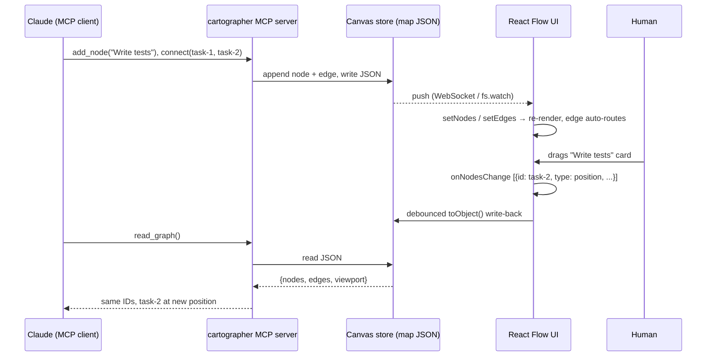
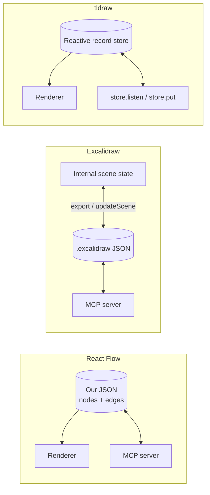

# Canvas Data Structures — What Claude Actually Reads and Writes

Date: 2026-07-11. Companion to `research-canvas-frameworks.md` (the ranked survey). That doc picked React Flow; this one shows *why* at the data-structure level: the same tiny scene serialized by tldraw, React Flow, and Excalidraw, then the mechanics of an AI agent reading and mutating each store while a human drags boxes around.

**The scene**: two task cards — "Fix auth bug" and "Write tests" — connected by one arrow.

## 1. The same scene, three ways

### tldraw — reactive record database

tldraw's document is a flat table of typed records keyed by ID. Everything — the document, pages, shapes, arrow attachments — is a record with a `typeName`. Since v2.2, arrow attachment is *not* on the arrow shape: each attached terminal is a separate `binding` record. Z-order and sibling order are fractional-index strings (`index: "a1"`). Snapshot below is the `document` half of `getSnapshot(editor.store)` (equivalently `store.getStoreSnapshot('document')`), shape trimmed to load-bearing fields:

```jsonc
{
  "store": {
    "document:document": { "gridSize": 10, "name": "", "meta": {}, "id": "document:document", "typeName": "document" },
    "page:page": { "meta": {}, "id": "page:page", "name": "Page 1", "index": "a1", "typeName": "page" },

    "shape:box1": {
      "x": 100, "y": 100, "rotation": 0, "isLocked": false, "opacity": 1, "meta": {},
      "id": "shape:box1", "type": "geo", "parentId": "page:page", "index": "a1", "typeName": "shape",
      "props": {
        "geo": "rectangle", "w": 200, "h": 80, "color": "black", "fill": "none",
        "richText": { "type": "doc", "content": [ { "type": "paragraph", "content": [ { "type": "text", "text": "Fix auth bug" } ] } ] }
        // + dash, size, font, align, verticalAlign, growY, url, scale, labelColor …
      }
    },
    "shape:box2": { /* same shape, x: 480, richText "Write tests", index: "a2" */ },

    "shape:arrow1": {
      "x": 300, "y": 140, "rotation": 0, "isLocked": false, "opacity": 1, "meta": {},
      "id": "shape:arrow1", "type": "arrow", "parentId": "page:page", "index": "a3", "typeName": "shape",
      "props": {
        "start": { "x": 0, "y": 0 }, "end": { "x": 180, "y": 0 },   // fallback points; bindings below override
        "bend": 0, "arrowheadStart": "none", "arrowheadEnd": "arrow"
        // + color, fill, dash, size, labelPosition, font, scale …
      }
    },

    "binding:b1": {
      "id": "binding:b1", "typeName": "binding", "type": "arrow", "meta": {},
      "fromId": "shape:arrow1", "toId": "shape:box1",
      "props": { "terminal": "start", "normalizedAnchor": { "x": 0.5, "y": 0.5 }, "isExact": false, "isPrecise": false, "snap": "none" }
    },
    "binding:b2": { /* terminal: "end", toId: "shape:box2" */ }
  },
  "schema": { "schemaVersion": 2, "sequences": { /* per-record-type migration versions */ } }
}
```

Note what's good here: uniform records, stable IDs, relationships as first-class rows (`binding:*` is literally a join table). It's a small graph database. Note also the cost: even "a rectangle with text" is a deep record with a ProseMirror rich-text doc inside, and correctness depends on the schema/migration machinery.

### React Flow (`@xyflow/react`) — two plain arrays you own

React Flow has no internal document. *You* hold `nodes[]` and `edges[]` in React state; the library renders them and hands you change events. `rfInstance.toObject()` returns exactly this:

```json
{
  "nodes": [
    { "id": "task-1", "type": "card", "position": { "x": 100, "y": 100 },
      "data": { "label": "Fix auth bug", "kind": "task", "status": "open" } },
    { "id": "task-2", "type": "card", "position": { "x": 480, "y": 100 },
      "data": { "label": "Write tests", "kind": "task", "status": "open" } }
  ],
  "edges": [
    { "id": "e-task-1-task-2", "source": "task-1", "target": "task-2",
      "sourceHandle": null, "targetHandle": null }
  ],
  "viewport": { "x": 0, "y": 0, "zoom": 1 }
}
```

That is the *entire* durable document. `data` is an arbitrary bag the library never interprets — which is exactly where cartographer's semantics (`kind`, `status`, session refs, whatever we invent) live, first-class, no smuggling. Runtime-only fields (`measured`, `selected`, `dragging`) get added in memory and are simply not persisted. Edges reference nodes by ID (`source`/`target`, optionally a specific `sourceHandle`/`targetHandle` on multi-port nodes) and re-route automatically on drag.

### Excalidraw — a freeform drawing with bindings bolted on

An `.excalidraw` file is `{type, version, source, elements[], appState, files}`. Elements are flat drawing primitives with ~25 fields each. A labeled box is **two** elements (rectangle + bound text via `containerId`); the arrow is a third with `startBinding`/`endBinding`. Ordering is a fractional `index` ("a0"…); `seed` drives the hand-drawn jitter; `version`/`versionNonce` drive edit reconciliation:

```jsonc
{
  "type": "excalidraw", "version": 2, "source": "https://excalidraw.com",
  "elements": [
    {
      "id": "rect-1", "type": "rectangle", "x": 100, "y": 100, "width": 200, "height": 80,
      "angle": 0, "strokeColor": "#1e1e1e", "backgroundColor": "transparent",
      "fillStyle": "solid", "strokeWidth": 2, "strokeStyle": "solid", "roughness": 1, "opacity": 100,
      "groupIds": [], "frameId": null, "index": "a0", "roundness": { "type": 3 },
      "seed": 1968410350, "version": 23, "versionNonce": 361174001, "isDeleted": false,
      "boundElements": [ { "id": "text-1", "type": "text" }, { "id": "arrow-1", "type": "arrow" } ],
      "updated": 1752200000000, "link": null, "locked": false,
      "customData": { "kind": "task", "status": "open" }        // only place OUR semantics can live
    },
    {
      "id": "text-1", "type": "text", "x": 145, "y": 128, "width": 110, "height": 25,
      "text": "Fix auth bug", "originalText": "Fix auth bug", "fontSize": 20, "fontFamily": 1,
      "textAlign": "center", "verticalAlign": "middle", "containerId": "rect-1", "lineHeight": 1.25,
      "seed": 401146281, "version": 8, "versionNonce": 1150084233, "index": "a1"
      /* + the same ~15 style/lifecycle fields as above */
    },
    { "id": "rect-2", /* …full boilerplate again… */ "customData": { "kind": "task" } },
    { "id": "text-2", "text": "Write tests", "containerId": "rect-2" /* … */ },
    {
      "id": "arrow-1", "type": "arrow", "x": 304, "y": 140, "width": 172, "height": 0,
      "points": [ [0, 0], [172, 0] ], "lastCommittedPoint": null,
      "startBinding": { "elementId": "rect-1", "focus": 0, "gap": 4 },
      "endBinding":   { "elementId": "rect-2", "focus": 0, "gap": 4 },
      "startArrowhead": null, "endArrowhead": "arrow", "elbowed": false,
      "seed": 776430879, "version": 41, "versionNonce": 927333333, "index": "a4"
      /* + boilerplate */
    }
  ],
  "appState": { "gridSize": 20, "viewBackgroundColor": "#ffffff" },
  "files": {}                                                    // embedded images, keyed by fileId
}
```

Same scene: React Flow spends 3 objects and ~12 meaningful fields; Excalidraw spends 5 elements and ~120 fields, most of which an agent must copy correctly or delegate to `convertToExcalidrawElements`; tldraw spends 7 records but every field is systematic.

## 2. Head-to-head

| Dimension | React Flow | Excalidraw | tldraw |
|---|---|---|---|
| Paradigm | Typed graph: `nodes[]` + `edges[]` in *your* state | Freeform drawing: flat `elements[]` scene | Reactive record DB: typed records incl. relationship rows |
| Where semantics live | `node.data` — arbitrary, first-class, library never touches it | `customData` escape hatch on drawing primitives | `props` (typed, needs custom shape defs) or `meta` bag |
| ID / record stability under human edits | Inert JSON — drag changes `position` only; nothing else churns | `id` stable, but every edit bumps `version` + regenerates `versionNonce`; agent writes must play along or be discarded on reconcile | Record IDs stable; store applies changes atomically; schema migrations handled on load |
| Connection model | Edge = `{source, target}` ID refs (+ optional handles); pure graph edge | Arrow element with `points[]` **and** `startBinding`/`endBinding` `{elementId, focus, gap}`; boxes back-reference via `boundElements` | Arrow shape (geometry) + separate `binding` records `{fromId, toId, props.terminal}` — relations as data |
| Change detection | Granular typed intents: `onNodesChange` (`position`/`add`/`remove`/`select`…), `onEdgesChange`, `onConnect` | `onChange(elements, appState, files)` — full scene every time; you diff by `version` | `store.listen(fn, {scope, source})` → granular `{added, updated, removed}` diffs; best-in-class |
| Serialization | `toObject()` → `{nodes, edges, viewport}`; the runtime state *is* the file | Export/import ceremony: `serializeAsJSON` ⇄ `updateScene`; internal state is not the file | `getSnapshot(editor.store)` → `{document: {store, schema}, session}` |
| License | MIT | MIT | **Proprietary "tldraw license" (source-available)** — license key + watermark regime; **disqualified**, included here because its store design is the reference point |

## 3. Feeding it back to Claude

### React Flow — the store is ours, so MCP is plumbing, not integration

State lives in a Zustand store as `{nodes, edges}`; persisted as JSON (JSON Canvas superset per the research doc). The cartographer MCP server exposes `read_graph`, `add_node`, `update_node`, `connect`, `remove` — each is a JSON edit. The UI subscribes (WebSocket push or `fs.watch`) and calls `setNodes`/`setEdges`; edges re-route themselves. Human drags emit `onNodesChange`; apply with `applyNodeChanges`, debounce, write the same JSON back. Claude never sees a foreign format — the wire format, disk format, and render input are one object.

**Worked example.** Claude calls `add_node` + `connect` on the one-box map. The entire mutation is two appended objects:

```jsonc
// delta produced by the MCP server — nothing else in the file is touched
nodes += { "id": "task-2", "type": "card", "position": { "x": 480, "y": 100 },
           "data": { "label": "Write tests", "kind": "task", "status": "open" } }
edges += { "id": "e-task-1-task-2", "source": "task-1", "target": "task-2" }
```

The human then drags the new card. React Flow fires `onNodesChange([{ "id": "task-2", "type": "position", "position": { "x": 412, "y": 248 }, "dragging": true }])` and after write-back the persisted diff is:

```diff
   { "id": "task-2", "type": "card",
-    "position": { "x": 480, "y": 100 },
+    "position": { "x": 412, "y": 248 },
     "data": { "label": "Write tests", "kind": "task", "status": "open" } }
```

IDs, edge, and semantics untouched. Claude's next `read_graph` sees exactly one changed field — spatial arrangement becomes legible agent input (clusters, proximity) for free.

### Excalidraw — workable via existing MCP servers, guarded by version mechanics

Read: `onChange` / `serializeAsJSON` gives the full scene; Claude filters on `customData`. Write: construct element skeletons and let `convertToExcalidrawElements` fill in `seed`/`version`/`versionNonce`/`index`/`boundElements`, then push via `excalidrawAPI.updateScene({elements})` — hand-writing raw elements risks reconciliation discarding stale-versioned writes. The ecosystem is real: official `excalidraw/excalidraw-mcp`, plus `yctimlin/mcp_excalidraw` (26 tools, element CRUD, WebSocket live sync into an open canvas). Day-one cost is low; the permanent tax is that every query ("what connects to what, of kind=task") runs over drawing primitives and back-pointer arrays rather than a graph.

### tldraw — architecturally the best loop, license-blocked

`store.listen` (scoped to `document` changes from `source: 'user'`) would give Claude precise diffs of human activity; `store.put([records])` / `store.remove([ids])` are transactional agent writes; tldraw sync generalizes the same loop to multiplayer. This is the design to *imitate* — MCP tools as record-store operations, relationships as rows — on top of React Flow's MIT substrate.

## 4. The loop, end to end (recommended architecture)



Where the source of truth lives in each system:



Only in React Flow is the store *already outside the library* — the other two require crossing an export/import or store-API boundary that the agent must respect.

## 5. So what

React Flow wins because its document is the degenerate case an LLM handles best: two arrays of small, flat, stable-ID objects whose only library-owned fields are `id`, `position`, and `source`/`target`, with all cartographer semantics in a `data` bag we design — human drags mutate exactly one field, so agent reads, agent writes, disk format, and render input are literally the same JSON with no version/seed/index machinery to violate. Excalidraw buys the best human drawing feel and ready-made MCP servers at the price of Claude manipulating verbose drawing primitives through versioning mechanics, with semantics exiled to `customData`. tldraw has the best store architecture of the three — flat typed records, relationships as binding rows, granular diff subscription — and we should copy those ideas into cartographer's MCP surface, but its proprietary license disqualifies it as a foundation.
