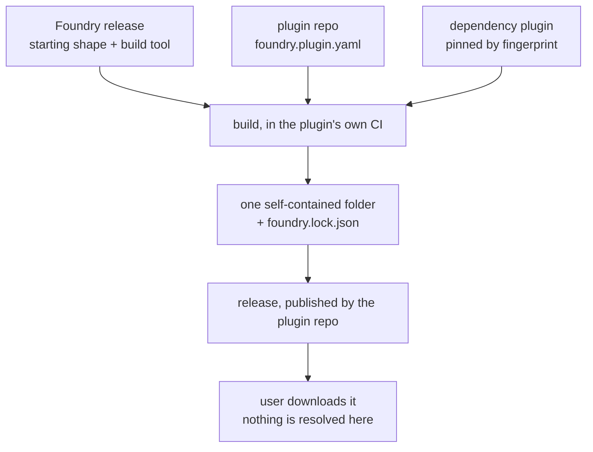

# ADR 0002: Foundry is the template and a dependency, not the home of plugins

**Status:** accepted (2026-08-09) · **Decided by:** Pi, in the foundry-split session.
**Supersedes:** two of ADR 0001's decisions. Gitignored build output, published by one repository to a single `release` branch, is replaced by each plugin repository building and publishing its own folder; whether an individual repository still ships from a release branch is open, below. Local-until-shared, which promoted a capability into a shared `library/` once a second bundle needed it, is gone along with the shared library itself. ADR 0001's materialize-copy over symlinks, and its version living in `plugin.json` only, both still stand.

## Verdict

- Foundry holds no plugins. It holds two things: the starting shape of a plugin repository, and the tooling that turns a plugin repository into a shippable folder.
- Each plugin lives in its own repository, with its own version and its own releases.
- A plugin declares the oldest Foundry it works with, and takes all of Foundry or none of it.
- Foundry uses ordinary three-number versions. A change to the first number is the only signal that something breaks, and the build refuses to cross one.
- Resolution happens once, in the plugin's own CI, at publish time. Nothing is resolved, fetched or assembled on a user's machine, so nothing can conflict there.
- A plugin may depend on other plugins, each pinned to an exact fingerprint. Two pins that disagree stop the build and name both sides.
- Third parties are first-class. Foundry keeps no list of who uses it, cannot see them, and never reaches into anyone's repository.

## ADR 0001 no longer holds because a monorepo cannot express a per-plugin release boundary

ADR 0001 chose a single repository with an internal shared `library/`, and recorded its own cost:

> A shared `library/` capability change requires bumping every consumer (manual now; automate later).

"Automate later" is now. Automating it needs three things a monorepo cannot express: a per-plugin version, a per-plugin declaration of what it consumes, and a release boundary to pin against. The standing decision that a change propagates by consumers pulling it through package infrastructure, rather than by a repository reaching into its consumers, is unimplementable while every consumer is a sibling directory resolved by name.

One half of that standing decision is now dead as written. Foundry cannot notify anyone, because it cannot enumerate the strangers who use it. It publishes a release; consumers watch and upgrade when they choose. Propagation is pull, with no push in front of it.

The rest of ADR 0001 survives. Copied content is still how a plugin ships self-contained; what changed is where the copy is sourced from.

## What this borrows and what it refuses

| Pattern | Verdict | One line |
|---|---|---|
| Monorepo with one internal shared library | absent | Replaced by this document |
| Lockfile plus content-fingerprint pinning, as cargo and npm do it | partial | The lock file is a record of what shipped, never an input to a later build |
| Ordinary three-number versioning for the artifact others depend on | use | Foundry only. A plugin's own version is its repository's business |
| Taking the highest of the declared minimums, as Go does | use | Applies to the Foundry version only, never to a plugin pin |
| Picking individual pieces of Foundry | none | A plugin takes all of it or none |
| Auto-resolving a pin disagreement to the newer side | none | The build stops and names both pinners and both pins |
| Template repository with copy-once semantics | partial | The starting shape is copied once. The build tool is fetched on every build |
| Notifying consumers that a release exists | none | Foundry cannot see its consumers, so there is nothing to notify |

## Decisions

| Decision | Why |
|---|---|
| Foundry stops holding plugins, skills, agents, shared libraries, MCP servers and applications. It holds the starting shape of a plugin repository and the build tool | The test for anything else: would someone building a completely unrelated plugin need this? If no, it is not Foundry |
| The build tool ships inside Foundry and reaches a plugin repository by being fetched at the declared version, never by being copied | A starting shape without its build tool is useless, and a copied build tool cannot be fixed once |
| Foundry uses ordinary three-number versions | Compatibility is the only thing a consumer needs to read off a version, and three numbers are the one convention that carries it. Foundry moves slowly once stable, so the numbers stay meaningful. The first and second are Pi's; the third is Claude's |
| A change to the first number of the Foundry version is the only signal that something breaks. The build stops when a plugin needs a first number this build tool is not, and names the migration document to read | One number, one meaning. No separate contract field to keep in step |
| A plugin declares the oldest Foundry it works with, not an exact version. The build takes the newest version anything in the dependency tree actually asked for, and never anything newer than that | A build can never quietly land on a version nobody requested, and a plugin that asks for more than the running build tool can give stops the build instead of being downgraded |
| A plugin takes all of Foundry or none of it | Everything Foundry ships is needed by every plugin. Selection would let repositories drift into subsets that no longer describe the same thing |
| A plugin may depend on other plugins, each pinned to an exact fingerprint. A moving name such as `latest`, `main` or `head` is refused outright | A pin has to mean the same thing tomorrow as today. Following a moving target is how a plugin ships against something it was never built with |
| A plugin dependency hands over named items only, from skills, agents, commands and hooks, and from nowhere else | A dependency can never write outside those directories, so taking one cannot reshape the repository that took it |
| Two dependencies wanting different builds of the same third plugin stops the build, naming both sides and both pins. Nothing is chosen automatically | A disagreement has no correct answer. Consumers are machine-paced and CI rebuilds unconditionally, so no human is present to catch a silent substitution, and a loss nobody sees is the failure mode this project rejects everywhere |
| A pin that does not match the fingerprint of the copy present at build time stops the build | A pin that is not checked is a comment |
| Two dependencies handing over the same path stops the build, naming both | Only one can ship, and picking one silently means nobody finds out which |
| A plugin that claims to provide something absent from the built folder stops the build | Otherwise the metadata is a claim nobody checks, and it drifts the first time an item is renamed |
| A plugin is fingerprinted by what it ships, not by its source | The shipped folder is the unit people install, so it is the unit that gets a name |
| A plugin may sit on an old Foundry version indefinitely. Upgrading is always the plugin owner's choice | Foundry cannot run a plugin's tests, so only that plugin can approve its own upgrade |
| Foundry keeps no list of consumers, and nothing in the build reaches out of the repository it runs in | Third parties are first-class and invisible to Foundry by construction. A list would invert the dependency direction and would be wrong the moment a stranger forked |
| The corpus is out of scope. It sits outside the repository, at the project's `research/chat-docs`, and is tracked in `~/.claude/TODO.md` as the corpus-into-Alexandria item | The split does not depend on it. The manifest has no place to declare a corpus today, and will need one only when Alexandria exists |

## Structure

One plugin repository builds one self-contained folder, once, at publish time.

Foundry reaches a plugin repository two ways, decided by whether the content can still be fixed after the repository exists.

| Kind | Contents | Delivery | Updating |
|---|---|---|---|
| Starting shape | Directory layout, CI workflow, plugin `CLAUDE.md`, an empty manifest, the bootstrap stub | Copied once, when the repository is created | Rare. Merged from Foundry by hand when it matters |
| Build tool | `resolve.py`, `build.py`, the manifest format, and every check they enforce | Fetched on every build, from the Foundry release the manifest names | Change one line in the manifest |

**Must not:** the starting shape must not hold anything a plugin will later need a fix to, because there is no path from Foundry back into a repository that already exists. Anything that must reach repositories already created belongs in the build tool.

## One copied file exists because the build tool cannot fetch itself

A plugin repository needs the build tool to fetch Foundry, and the build tool lives inside Foundry. One genuinely copied file breaks the loop: `template/scripts/foundry.py` reads the `foundry:` line from the manifest, shallow-clones that tag, and hands off to the build tool inside it. It is the only file that ever needs re-copying by hand across repositories, so it must stay small enough never to change.

It reads that one line and works nothing else out. Whether the declared version is actually old enough for the whole dependency tree is the build tool's judgement, made after every manifest has been read.

GitHub template repositories carry no upstream remote. Creating a repository must also add Foundry as a remote, or the hand merge of the starting shape in the table above is impossible later.

## Consequences

- Foundry's own version number is a public promise to people who never announced themselves. A careless second-number bump that actually breaks a consumer destroys the only break signal there is, and breaks strangers silently.
- Sharing between plugins stops being Foundry's business. Two parties who want to share code make their own repository and point at it with a pin. The shared library and its Rule-of-Three promotion gate from ADR 0001 are gone, not relocated.
- The boundary check that forbade one plugin referencing another's internals by path has no subject left. Separate repositories make such a reference impossible to write, and the script that enforced it left the repository with everything else that was not base.
- A plugin with dependents that ships a new build forces its dependents to update their pin. Nobody is told. They find out when they next build, or when they choose to look.
- The lock file is history, not instructions. Nothing reads it back to reproduce a build. It exists so that when a shipped plugin misbehaves, what it was built from is a fact rather than a reconstruction.
- The build already names migration documents that do not exist yet. The first change to the first number has to create `docs/migrations/` along with the document the failure message points at.

## What these decisions make impossible

| Previously possible | Foreclosed by |
|---|---|
| A user's machine resolving anything, or two installed plugins conflicting there | Resolution happens once, in the plugin's own CI, and one self-contained folder ships |
| A build landing on a Foundry version nobody asked for | The build takes the newest version something in the tree actually asked for, and never anything newer |
| A breaking change reaching a plugin with no signal | Only a change to the first number means a break, and the build stops rather than crossing one |
| Two plugin repositories drifting into incompatible subsets of Foundry | A plugin takes all of Foundry or none of it |
| A pin quietly meaning something different next week | Pins are exact fingerprints, and a moving name is refused outright |
| A silent winner when two dependencies disagree, or when two hand over the same path | The build stops and names both sides |
| Fixing the build tool in one repository and not in the others | The build tool is fetched from a Foundry release, never copied |
| Shipping metadata that claims something the folder does not contain | The build checks every claim against the built folder before writing the lock file |
| Foundry needing to know, or being able to learn, who its consumers are | Nothing in the build reaches out of the repository it runs in |

## Still open

| Item | Status | Evidence |
|---|---|---|
| A pin is meant to be the `contents` fingerprint from a dependency's lock file, but the check compares it against a fingerprint of the dependency directory found at build time. Those are two different trees, so a correct-looking pin will be rejected | open, and blocking the first plugin-to-plugin dependency | `resolve.py` `resolve()`, `build.py` `write_lock()`, `template/foundry.plugin.yaml:26` |
| `docs/migrations/` does not exist, though a failure message already names files inside it | open | `resolve.py` `check_foundry_major()` |
| Where the extracted plugins, shared review skills, manifold package and web application land | open, a later session decides | |
| Whether a single plugin repository still publishes its built folder to a `release` branch and is served by a marketplace `git-subdir` source, now that the one-repository-for-everything version of that shape is superseded | open | |
| How a repository is created from the starting shape, including adding the Foundry remote so a later merge is possible | open | |
| The corpus into Alexandria | deferred, tracked in `~/.claude/TODO.md` | |
