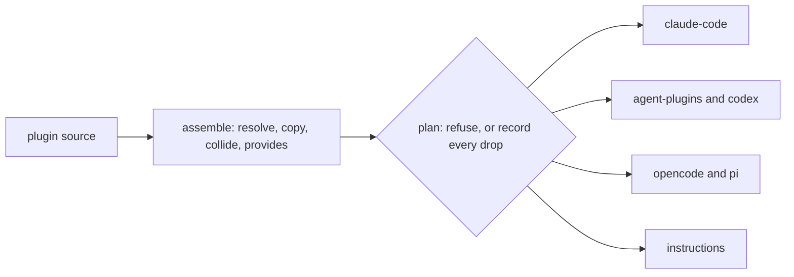

# ADR 0003: One plugin source, one release, one folder per harness

**Status:** accepted (2026-08-09) · **Decided by:** Pi, in the foundry-split session.
**Extends:** ADR 0002, which decided what Foundry is. This one decides what it emits. Nothing in 0002 is superseded: resolution still happens once in the plugin's own CI, a plugin still takes all of Foundry or none, and a pin is still the fingerprint of a dependency's source checkout.

## Verdict

- Foundry emits for several agent harnesses from one source. The author writes the plugin once and does not learn six vocabularies.
- Foundry adopts Agent Plugins 1.0.0 for the package shape and Agent Skills for the skill file rather than inventing a neutral form. Both are published standards with more than one vendor behind them.
- Agent Plugins 1.0.0 standardises exactly two component types, skills and MCP servers. Agents, commands and hooks are Foundry's own invention, and this document says so plainly rather than implying a standard exists.
- Claude Code is not on the Agent Plugins compatible-client list and keeps its own manifest path, so two package shapes exist rather than one. That is a fact about the ecosystem, not a Foundry preference.
- A build never decides on its own to drop something. A declared kind a named harness cannot represent stops the build, or the author pre-authorised the loss and it is printed and recorded. There is no third outcome.
- A plugin that names no harness builds exactly what it built before this decision, byte for byte, in the same path. Multi-harness output is opt-in through one manifest key.

## The standard covers less than its name suggests, and that decides the architecture

Agent Plugins 1.0.0 was published on 2026-08-06 by its own Technical Steering Committee, with core maintainers from Amazon, Cursor, Microsoft, OpenAI and Vercel, and Google announced joining as a core maintainer the same day (https://raw.githubusercontent.com/agentplugins/agent-plugins-spec/main/MAINTAINERS.md). It is governed separately from the Linux Foundation work: the Agentic AI Foundation hosts exactly four projects, being MCP, goose, AGENTS.md and agentgateway, and this is not one of them (https://aaif.io/projects/).

Its own text states that "other proposed component types, such as commands, hooks, agents, rules, and LSP servers, remain too client-specific for a stable portable contract and are outside the v1 format" (https://raw.githubusercontent.com/agentplugins/agent-plugins-spec/main/spec/1.0.0.md). So the shared standard covers skills and MCP server configuration, and nothing else.

Its published compatible-client list names Codex, Cursor, GitHub Copilot, VS Code, Kiro and ChatGPT. Claude Code, Pi, OpenCode and Gemini CLI are all absent, and Anthropic is not on the committee (https://raw.githubusercontent.com/agentplugins/agent-plugins-site/main/lib/compatible-clients.ts). Claude Code reads its own `.claude-plugin/plugin.json` (https://code.claude.com/docs/en/plugins-reference).

Two facts follow, and they are the whole architecture. There is exactly one artifact that reaches every harness surveyed: a directory holding a `SKILL.md`. And no single folder can serve every harness, because the portable package and the GitHub Copilot package both claim a root `plugin.json` under different schemas, distinguished only by their `$schema` value.

## What this borrows and what it refuses

| Pattern | Verdict | One line |
|---|---|---|
| Agent Plugins 1.0.0 as the package shape | use | Adopted whole, including the closed manifest and the `mcp.json` path it names |
| Agent Skills as the skill file format | use | A `SKILL.md` from a Foundry repository validates on its own and can be copied out by hand |
| A neutral intermediate form for agents, commands and hooks | partial | Invented by Foundry, minimally, because no standard covers them. Stated as invention, not as a standard |
| One universal output folder | none | Two package shapes claim the same root filename with incompatible schemas |
| Cross-compiling a hook into each harness's event vocabulary | none | Five vocabularies of 31, about 20, 11, 11 and 8 events with a four-moment intersection. A hook that silently does not fire is a false security claim |
| One repository per harness, or one branch per harness | none | A pin is the fingerprint of a source checkout and there is one source checkout. Branches are moving targets, which `resolve.py` already refuses |
| Several folders inside one release, one version number | use | One tag, one resolution answer, each folder independently installable |
| AGENTS.md as the neutral form | none | No schema, no frontmatter, no validator, and it cannot ship inside an installable package on any surveyed harness |
| A per-harness override block in the manifest | absent | Only `targets` and `degrade` are added. A harness needing a field the neutral form lacks is a refusal today |

## Decisions

| Decision | Why |
|---|---|
| Foundry emits one folder per harness named under `targets`, from one source, in one build | The author writes the plugin once. Learning six vocabularies is the cost this repository exists to remove |
| The build tool splits into an assemble half that knows about no harness and an emit half that knows about exactly one | The assemble half already existed and was correct. Every per-harness fact then has exactly one place to live, and adding a harness is one module and one registry line |
| The Claude Code emitter started as an extraction whose output was byte for byte what `write_metadata` wrote before it existed | Every `contents` fingerprint in a shipped lock file was measured on those bytes. One changed byte invalidates every pin written against one, silently, on a machine Foundry cannot see. The byte-identical diff is the gate that runs before any emitter work |
| That folder has moved twice since, both before `v0.1.0`. First when the neutral `mcp.json` and `hooks/hooks.yaml` started being translated into the `.mcp.json` and `hooks/hooks.json` Claude Code reads | The untranslated folder shipped both files unread. `claude plugin details` reported `MCP servers (0)` and `Hooks (0)` while the install reported success, which is a silent drop and the one outcome the loss policy forbids. It moved only for plugins declaring an MCP server or a hook, and what the old number covered was two files Claude Code never opened |
| Second when a dot file at the top of a content directory stopped shipping, and a directory left empty by that sweep stopped shipping with it | The template holds `skills/`, `agents/` and `commands/` open with `.gitkeep` files so a new repository has somewhere to put its first skill. Every folder built from it shipped all three, so every folder carried files no harness reads and claimed an agent surface the plugin did not have. The `.gitkeep` files were also the only thing making the OpenCode and Pi folders differ from each other, which is a difference in git bookkeeping rather than in what anybody installs. `emitters.declared_kinds` already said a dot file does not declare a kind; this applies the same rule to the copy |
| Foundry adopts Agent Plugins 1.0.0 for the package and Agent Skills for the skill file | Adopting beats inventing, and here there is something to adopt. Neither is Foundry's to define, and a skill that only works because Foundry built it is the failure both formats prevent |
| The `$schema` value is pinned to the 1.0.0 constant | A client hard-fails on any other schema version rather than falling back. A specification revision is therefore a Foundry second-number bump, not a silent follow |
| Agents, commands and hooks are Foundry's own invention, and Foundry says so | Version 1 of the standard leaves all three out by name. Foundry defines the smallest form for each, using only fields every surveyed harness honours, so that when the standard grows the migration is a rename rather than a redesign |
| The neutral hook vocabulary is four moments: `session-start`, `before-tool`, `after-tool`, `session-end` | The intersection of five harnesses' event lists. Picking one vendor's names would make that vendor's model the neutral model, which is worse than a small neutral vocabulary |
| A hook rule names the moment with `at`, never `on` | YAML 1.1 resolves a bare `on` to the boolean true, in every YAML 1.1 reader, so `on: session-start` arrives keyed `true` and the rule names no moment. This was written as `on` and went unnoticed for as long as nothing read a rule. A key that means one thing written and another parsed is not a format |
| A rule's `run` is a path to a file inside the plugin, not a shell line | Foundry can then check at build time that the hook has something to run. A hook pointing at nothing does not fail, it silently never fires, and a hook is usually a guard. Shell work goes inside the file |
| No harness-specific key appears inside any content file. Everything per-harness lives in the manifest, which never ships | A `SKILL.md` from a Foundry repository passes the Agent Skills validator unchanged and survives being copied out by hand |
| A skill directory sits exactly one level under `skills/`, on every harness, and anything deeper stops the whole build | Agent Plugins and Gemini CLI read one level; Claude Code, Pi and OpenCode recurse. A grouping directory therefore ships intact on part of the list and hides every skill under it on the rest, with no error raised anywhere (https://agentskills.io/specification) |
| A declared kind a named harness cannot represent stops the build, naming the kind, the harness, the manifest line and both ways forward | Every failure in this space is otherwise silent. The folder installs, reports success, and does less than its README says. Refusing is the only outcome that reaches the person who can decide |
| The manifest may pre-authorise one kind's loss on one harness under `degrade.<harness>.drop`, and then the drop is printed at build time and written into that folder's lock file and into `foundry.release.json` | A loss the author chose is a decision. A loss the tool chose is a bug. Recording it in the folder means a diminished package says so from inside itself, and reprinting it on every build means the person watching is given one last chance to notice |
| Every kind-level loss is waivable, including one that guts the package | The refusal itself names the waiver, so an author who reads it and still wants the folder has a way to say so. What cannot be waived is a loss that changes behaviour rather than reducing it |
| A loss that changes behaviour rather than reducing it is refused by the emitter, with no waiver | A guard that fails open, a matcher that matches everything, a transport a client skips at startup. These depend on what is inside a file rather than on which kind it is, so the emitter raises them while it is looking at the file |
| Every harness is assessed before any folder is written | A build that cannot ship one folder stops without having written the others. Half a release is worse than none, because the folders that did appear look complete |
| A `Capability` names all six kinds, in `carries` or in `cannot`, and the framework refuses to dispatch otherwise | When a seventh kind is added, no harness can carry it silently on the grounds that nobody re-read that module |
| No harness folder holds a file that harness does not read | An unread file sits outside whatever that harness validates and inside the folder's `contents` fingerprint, so it ships and the record cannot explain it. This is the same failure as the author's local `.claude` settings reaching people who installed a plugin |
| MCP servers are always the plugin's own and are never taken from a dependency | Merging two `mcpServers` objects is a winner-picking problem with no correct answer. `CONTENT_KINDS` stays exactly skills, agents, commands and hooks |
| A value inside `env` is always a `${VAR}` placeholder and never a secret | A credential published in a release asset cannot be recalled |
| One repository, one release, one version number, several folders. Each folder is fingerprinted separately | The version names the source and the resolution answer, not the capability set. The folder is what people install, so the folder is what gets a name |
| A plugin that names no `targets` builds exactly what it built before, in the same path, byte for byte | The default in code is compatibility. The default in the template is the multi-harness list, so a new repository is multi-harness from its first build and an existing one changes nothing until its owner asks |
| Repository instruction files are emitted as their own target and described as a different delivery mechanism, never as support | No surveyed harness lets a package carry one. Claude Code states a `CLAUDE.md` at a plugin root is not loaded as project context (https://code.claude.com/docs/en/plugins-reference), so the only route is a person copying it, and from that moment nothing updates it |
| The schema validator lives in `tests/` and never in `scripts/` | The build runs in strangers' CI and may import nothing beyond pyyaml. The emitters hand-code the constraints they must satisfy anyway to emit valid output |

## Structure

One staging pass, then one emitter per named harness. Everything left of the fork is the build tool that already existed.

| Part | Owns | Must not |
|---|---|---|
| `scripts/build.py` | Assembling the neutral tree, then writing a lock file inside each folder and the release record beside them | Know the name of any harness, or decide anything about loss |
| `emitters/__init__.py` | The registry, the loss policy, pruning, the skill depth check | Know how any one harness spells anything |
| `emitters/contract.py` | What a module declares, and every shared piece of file work | Hold anything true of only one harness |
| One emitter module | One harness's manifest and folder shape, and refusals about file content | Resolve, fetch, reorder, reach outside its tree, touch a fingerprint, or contain loss logic for a kind |

The framework deletes every kind a harness cannot carry before that emitter runs. An emitter cannot see what its harness cannot carry, which is what keeps loss logic out of all of them.

## The alpha covers six harness outputs and names what it refuses to fake

| Target | What it is | Confirmed by |
|---|---|---|
| `agent-plugins` | the portable package: root `plugin.json`, `mcp.json`, `skills/<name>/SKILL.md` | Loaded by GitHub Copilot CLI, and validated against the published schema (https://agent-plugins.org/schemas/1.0.0/plugin.schema.json) |
| `claude-code` | `.claude-plugin/plugin.json`, `.mcp.json`, `hooks/hooks.json`, and every kind Foundry models | Loaded by Claude Code, which lists the skills, the agent, the MCP server and the hook. `claude plugin validate --strict` passes |
| `codex` | the portable package plus `.codex-plugin/plugin.json` | Loaded by Codex, skill and MCP server both listed by it |
| `opencode` | a loose tree of `skills/` and `agents/`, no manifest | Loaded by OpenCode (https://opencode.ai/docs/skills/) |
| `pi` | a loose tree of `skills/` and `prompts/`, no manifest | Folder layout only. Pi is not installed on the machine that built this and publishes no manifest schema (https://pi.dev/docs/latest/packages) |
| `instructions` | `AGENTS.md` plus a `CLAUDE.md` and a `GEMINI.md` pointing at it | Loaded by Claude Code from a scratch repository. There is no schema and no validator for any of the three (https://agents.md/) |

Out of the alpha on purpose: Cursor native, GitHub Copilot native, the Gemini CLI extension, themes, rules, LSP servers, marketplaces outside Claude Code, secrets, and hooks anywhere except Claude Code. Each is deferred rather than done badly, and the reason is the same every time: the format was available only as prose, or the intersection between harnesses is empty, or a partial answer would install cleanly and do nothing.

## Consequences

- Adding a harness is one module and one registry line, and nothing else in Foundry changes. That is the test of whether the seam is in the right place, and `emitters/claude_code.py` at under forty lines is the evidence.
- A plugin's green build can go red the day its author adds a harness to `targets`. That is the harness telling the truth about what it carries, and the refusal names both ways forward.
- The same version across several folders does not mean the same contents. Anyone reading a release has to read `foundry.release.json` to know what each folder actually holds.
- Two of the six targets ship loose files rather than packages. OpenCode and Pi have no install command, no version and no update path, so a plugin's own README has to say a person copies the folder by hand.
- The instructions target writes into a repository somebody else owns. Nothing installs it, updates it or removes it, and a later version of the plugin never reaches the copy.
- Pi ships without ever having been run. It is asserted from documentation and folder layout only, and that has to be said in the release note rather than implied.
- A specification revision to Agent Plugins strands the portable folder on clients that hard-fail on the version constant. The constant is pinned deliberately, and following a revision is a decision with a version bump attached, never a silent follow.

## What these decisions make impossible

| Previously possible | Foreclosed by |
|---|---|
| A diminished folder that nobody chose | Two outcomes only: a refusal, or a loss the author wrote down and the build printed and recorded twice |
| A guard that fails open, a matcher that matches everything, a permission list nobody enforces | A loss that changes behaviour rather than reducing it is refused by the emitter, with no waiver |
| A package whose skill list differs by harness | Skills exactly one level deep, enforced once on the neutral tree and stopping the whole build |
| A skill that only works because Foundry built it | No harness-specific key inside any content file. Everything per-harness lives in the manifest, which never ships |
| An unread file shipping inside a folder where the record cannot explain it | No harness folder holds a file that harness does not read. An emitter that translates a neutral file removes the neutral one |
| A quiet change to what every existing plugin ships | A manifest that names no `targets` produces the same bytes at the same path, lock file included, and a test asserts the fingerprint string |
| Half a release, where the folders that appeared look complete | Every harness is assessed before any folder is written |
| A kind added later being carried silently by a harness nobody re-read | A `Capability` answers for all six kinds, or the build refuses and calls it a Foundry defect |
| An emitter growing into a second resolver, or two harnesses using different dependency versions | Emitters run after staging and may not resolve, fetch or reorder |
| Two `mcpServers` objects merged by a rule nobody chose | MCP servers are the plugin's own and are never taken from a dependency |
| A credential published in a release asset | Placeholders only inside `env`, never a value |
| A version number meaning different sources in different places, or a pin pointing at a moving branch | One repository, one release, one version, several folders, each separately fingerprinted |
| A build tool that fails in a stranger's CI because of a new dependency | The schema validator lives in `tests/`, and `scripts/` imports nothing beyond pyyaml |

## Still open

| Item | Status | Evidence |
|---|---|---|
| The per-harness event names each of the four neutral hook moments maps to | closed for Claude Code, open for the rest. All four map to exactly one Claude Code event each, and a moment with no exact event would be refused rather than approximated | https://code.claude.com/docs/en/plugins-reference. Hooks ship on Claude Code only until the others are read |
| Whether OpenCode's own command format can be emitted | open. Its documentation calls the `template` frontmatter key required on one line and says the body becomes the template on the next | https://opencode.ai/docs/plugins/ |
| Every capability in `skills_tree.py` and `instructions.py` was read from documentation, not from loader source | open. Foundry's rule is that code beats prose, and the code was not read | Expect the OpenCode command line to move once it is |
| Whether Pi's loose-file layout is what Pi actually reads | open. Pi is not installed on the machine that built this and publishes no manifest schema | https://pi.dev/docs/latest/skills |
| Whether the release should carry an asset name per folder | open. `foundry.release.json` names the target, the fingerprint and the drops. A zip name is CI's to make, not the build's | `write_release` in `scripts/build.py` |
| Whether a harness override block belongs in the manifest | open. Today a harness needing a field the neutral form lacks is a refusal, and whether that stays acceptable is unproven | |
| Whether Foundry publishes a list of harnesses anywhere public | open. Foundry keeps no list of consumers, and a list of harnesses is not a list of consumers, but the distinction has to be written down before somebody reads the table above as an endorsement | ADR 0002, on keeping no list of consumers |

## Sources

| Claim | Surface |
|---|---|
| Agent Plugins 1.0.0 covers only skills and MCP servers, and excludes commands, hooks, agents, rules and LSP servers from version 1 by name | https://raw.githubusercontent.com/agentplugins/agent-plugins-spec/main/spec/1.0.0.md |
| The manifest is a closed object with a constant `$schema`, at the package root | https://agent-plugins.org/schemas/1.0.0/plugin.schema.json |
| Its steering committee: Amazon, Cursor, Microsoft, OpenAI, Vercel, with Google joining | https://raw.githubusercontent.com/agentplugins/agent-plugins-spec/main/MAINTAINERS.md |
| Its compatible-client list, which omits Claude Code, Pi, OpenCode and Gemini CLI | https://raw.githubusercontent.com/agentplugins/agent-plugins-site/main/lib/compatible-clients.ts |
| The Agentic AI Foundation hosts four projects, and Agent Plugins is not one | https://aaif.io/projects/ |
| Skill frontmatter rules, and that `allowed-tools` is experimental | https://agentskills.io/specification |
| Claude Code reads `CLAUDE.md` and not `AGENTS.md` | https://code.claude.com/docs/en/memory |
| Claude Code's own plugin manifest path, and that a plugin cannot carry a repository instructions file | https://code.claude.com/docs/en/plugins-reference |
| AGENTS.md has no schema, no frontmatter and no validator | https://agents.md/ |
| MCP is a protocol standard and packaging is per vendor | https://modelcontextprotocol.io/ |
| Codex retired custom prompts and directs authors to skills | https://github.com/openai/codex/issues/15941 |
| OpenCode reads a skills tree and has no manifest format | https://opencode.ai/docs/skills/, https://opencode.ai/docs/plugins/ |
| Pi excludes MCP on purpose, and reads `allowed-tools` in skill frontmatter | https://pi.dev/docs/latest/packages, https://pi.dev/docs/latest/skills |
| GitHub Copilot reads the Agent Plugins package | https://docs.github.com/en/copilot/concepts/agents/about-agent-skills |
| Cursor's two published schemas | https://raw.githubusercontent.com/cursor/plugins/main/schemas/plugin.schema.json, https://raw.githubusercontent.com/cursor/plugins/main/schemas/marketplace.schema.json |
| Gemini CLI publishes no schema for its extension manifest | https://github.com/google-gemini/gemini-cli |
