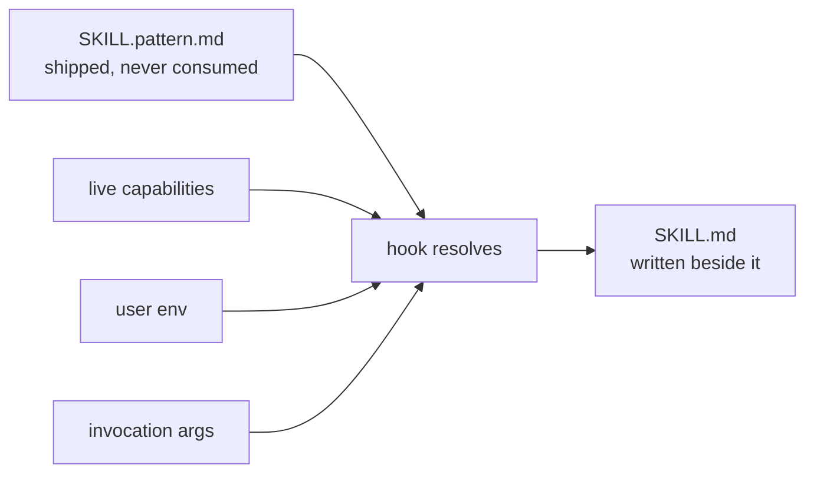
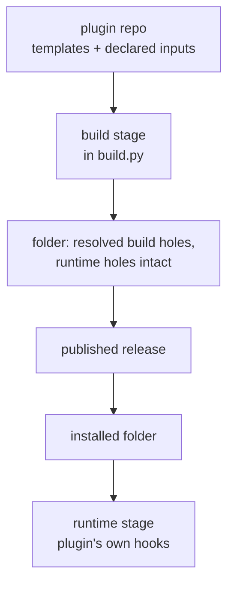

# ADR 0004: Templating binds in two places, and one of them is the user's machine

**Status:** proposed (2026-08-09) · **Decided by:** Pi, in the pattern-templating session.
**Amends:** ADR 0002's decision that nothing is resolved on a user's machine, and the matching
invariant in `CLAUDE.md`. Neither is superseded. Both are narrowed, and the narrowing is stated in
one sentence below so nobody has to reconstruct it.

## Verdict

- Foundry gains a template language for the markdown a plugin ships. Working name Pattern, a
  placeholder: the real name is not decided.
- It binds in two places. Build time, in the plugin's own CI. Runtime, on the machine the plugin is
  installed on.
- The runtime half exists for exactly one reason. Whether a skill belonging to a different plugin is
  installed is only knowable where both are installed, and a plugin's build is forbidden from
  looking outside its own repository.
- The runtime half runs as two hooks the plugin ships. Foundry's existing neutral hook vocabulary
  already expresses both, so no emitter changes.
- "Nothing is resolved on a user's machine" becomes false as written. The property that sentence
  exists to protect, that two installed plugins cannot conflict, survives untouched.
- The build-time half would be the first content transformation `build.py` performs on a skill body.

## The motivation is 18 dangling cross-references, not duplication

The original specification argued from duplication. That was measured against the pre-split tree and
it did not hold.

| Claim in the original specification | Measured | Where |
|---|---|---|
| The corpus repeats enough content to justify a language | 0 duplicate files | `research/pattern-lab/spikes/s0_corpus_duplication.py` |
| Build-time composition is missing | `build.py` already copies named items across a dependency boundary | `scripts/build.py:185` |
| A live capability check and byte-deterministic output can coexist | They cannot. One of the two has to give | `research/pattern-lab/findings/01-assumption-ledger.md` |
| 200 to 300 lines | 621 | `research/pattern-lab/src/pattern.py` |
| Availability-aware inline enumerations are expressible | They are not. Only bullet form works | `research/pattern-lab/spikes/s7_real_corpus.py` |

The lab those paths name sits outside this repository, at the project level, and is not reachable
from a clone. It is named so the numbers can be re-run, not so they can be read here.

What did hold is a different fault. A shipped skill states in prose which other skills use it, and
names skills the installing user may not have:

```
skills/red-vs-blue/SKILL.md
  Used by: audit, brief, consult, grill-with-docs, hats, manifold, plan-orchestrator

that plugin ships:
  audit  consult  hats  red-vs-blue  wardrobe
```

Four of those names belong to other plugins, which after the split means other repositories. The
build cannot check the claim, because reaching another repository is the one thing the resolver is
forbidden to do. Nothing in `build.py` or `.github/checks/` reads skill prose, so nothing catches it
now and nothing would catch it later.

**A build-time answer would be the author's guess.** At build time this plugin knows what it ships
and nothing about what sits beside it after install. Only the installed machine knows both. That is
the whole argument for a runtime bind, and it is the only argument for one.

## What this borrows and what it refuses

| Pattern | Verdict | One line |
|---|---|---|
| A total language, no recursion and no loops, as Dhall | use | Termination comes from the grammar, never from a step limit |
| Staged evaluation, a later-stage construct surviving an earlier stage byte-identical | use | Build output that still holds runtime holes is a correct build output |
| Hermetic evaluation with every input declared and hashed, as Starlark | partial | Build time only. The runtime stage reads live state, on purpose |
| Lexically isolated inclusion, as Jinja's import rather than its include | use | An included skill sees what the use site binds and the ambient layers, nothing else |
| Logic-less templating, as Mustache | none | The conditional is the feature |
| Availability-filtered inline enumeration | absent | Not expressible in version one. The separator problem, measured |
| Content-addressed imports with integrity hashes, as Dhall | none | Foundry already pins by fingerprint, at a layer below this one |
| C preprocessor style textual inclusion with dynamic scope | none | The reason inclusion is lexical above |

## Where each construct binds, and why it cannot bind elsewhere

| Construct | Binds | Known by | Cannot bind earlier or later because |
|---|---|---|---|
| `{{build.*}}` | build | the publisher | Nothing about it changes after publish |
| `{{use skill.x k=v}}` | build | the publisher | Composition of shipped content is settled when the folder is written |
| `{{env.*}}` | runtime | the installing user | The publisher cannot know one user's org, paths or conventions |
| `has(plugin\|skill\|mcp.<id>)` | runtime | the installed machine | Only the machine holding both plugins can see both |
| `{{arg.*}}` | runtime, per invocation | the caller | Arguments do not exist until the call is made |

## The runtime half is two hooks, because two surfaces read skill text at two moments

One hook is not enough, and the reason is a fact about the harness rather than a preference.

| Hook | Resolves | Why that moment and no other |
|---|---|---|
| `at: session-start` | `{{env.*}}`, `has()` | The skill listing is built from each `SKILL.md` frontmatter description before any tool runs. A hole in a description is only reachable here |
| `at: before-tool`, `match: Skill` | `{{arg.*}}`, and `has()` again | Arguments arrive in the tool input. There is no earlier moment at which they exist |

Both are already expressible. `at` takes `session-start` and `before-tool` today
(`scripts/emitters/claude_code.py:104`), a rule already carries an optional `match`
(`scripts/emitters/claude_code.py:111`) which is passed through as the harness's matcher
(`scripts/emitters/claude_code.py:329`), and a rule's `run` is executed from inside the installed
folder (`scripts/emitters/claude_code.py:334`). Nothing in the hook vocabulary changes.



The source file is never consumed, so the resolver is idempotent and a changed environment
re-resolves correctly on the next session.

## What this costs

| Cost | Detail |
|---|---|
| The installed folder changes after install | `foundry.lock.json` records `contents` for the bytes that shipped, and `SKILL.md` is written after. The lock file is already declared history rather than instructions, so the record stays true about what shipped and stops describing what is on disk |
| Two of six harnesses cannot run it | Agent Plugins 1.0.0 defines no hook component and OpenCode has no declarative hooks. Those folders ship the source unresolved, or take a `degrade` line |
| Two sessions can race | Both resolve the same skill and write the same file. Harmless while only `{{env.*}}` and `has()` are in play, since both produce the same bytes. It becomes real the moment `{{arg.*}}` bakes a per-call value into a shared file |
| A skill body is transformed for the first time | Every content copy in `build.py` is byte-for-byte today and no skill body is modified anywhere. The build-time pass has to hold the same line the three existing transformations hold: touch what the template names and leave every other byte alone |

## Consequences

- The invariant in `CLAUDE.md` reading "Nothing resolves on a user's machine" is replaced by a
  narrower one: nothing on a user's machine fetches, and nothing assembles a folder. Rendering text
  already present in the folder is allowed, and creates no conflict between two plugins.
- A plugin that uses the runtime half stops being installable-and-finished on the two harnesses with
  no hook surface. That is a `degrade` decision its author writes down, in the same place and the
  same way as every other loss.
- The `contents` fingerprint keeps meaning what it always meant, the bytes that shipped. Any future
  check that compares it against the folder on disk would be wrong, and this is the reason.
- A resolver that fails at session start must fail loudly and leave the source in place. A silently
  half-resolved `SKILL.md` is the same class of failure as a silent drop, which this repository
  rejects everywhere else.

## Still open

| Item | Status | Evidence |
|---|---|---|
| The real name of the language, and the two file extensions. `Pattern`, `SKILL.pattern.md` and `SKILL.md` are placeholders carried from the lab | open, and blocking any file being written | original specification, section 6 |
| Whether `{{arg.*}}` ships in version one at all, given it is the only construct that makes the concurrent-session race real | open | the cost table above |
| Whether the two harnesses with no hook surface get an automatic `degrade`, or a refusal the author has to answer | open | `scripts/emitters/__init__.py` loss policy |
| Whether a skill that never uses a runtime construct should still be renamed to the source extension | open | affects every existing plugin's diff |

---

# How templating should work

Everything above describes what exists and what was measured. Everything below is what is being
asked for. It says nothing about cost, effort or ordering: those belong in the plan, at
`docs/plans/pattern.md`.

## Requirements

| # | Requirement | Because |
|---|---|---|
| R1 | A template resolves fully at build time when it uses only build-time constructs, and the result is byte-identical across runs and machines | Every fingerprint in this repository is measured on shipped bytes, and a fingerprint that moves for nobody breaks every pin written against it |
| R2 | A construct that binds at runtime survives the build stage byte-identical | Otherwise the build has to guess at a value only the installed machine holds, which is the fault this document exists to fix |
| R3 | The capability set the build stage may read is an explicit declared input, never live state | A build that read the machine it ran on would produce a different folder in CI than on a laptop, with no record of why |
| R4 | `has()` at runtime reads what is actually installed, across plugin boundaries | The 18 dangling references are cross-plugin by construction, and no other stage can see across that boundary |
| R5 | An unresolvable hole stops the run and names the file, the hole and the layer it looked in | A refusal with no next step is a bug, and a silently empty hole is a silent drop wearing different clothes |
| R6 | The source template is never consumed. Resolving twice from the same source gives the same answer for the same inputs | A resolver that eats its input cannot re-resolve when the environment changes, and cannot be re-run after it fails halfway |
| R7 | Fenced code, inline code spans, and an escaped opening brace are never resolved | A skill that documents this language must be able to show it |
| R8 | The build stage touches only the bytes a construct names | Three content transformations exist today and all three avoid re-dumping YAML for this reason |
| R9 | A harness that cannot run the runtime stage is named at build time, not discovered at install | This is the no-silent-drop rule applied to a new kind of loss |
| R10 | Nothing the resolver does on a user's machine fetches anything, or writes outside the installed folder | This is what survives of the invariant being narrowed, and it is the part that carries the conflict-free property |

## Structure



| Part | Does | Must not |
|---|---|---|
| Build stage | Resolves build-time constructs and static composition inside the neutral tree, after dependency content has arrived and before anything is claimed or counted | Read live machine state, read anything outside the tree it was given, reorder or reformat a byte no construct named, or resolve a runtime construct |
| Runtime stage | Reads the shipped source beside it, resolves runtime constructs against live state, writes the resolved file into the installed folder | Fetch anything, write outside the installed folder, consume the source, or leave a half-written file behind on failure |
| Neutral tree | Carries both resolved content and unresolved runtime constructs at the same time | Distinguish the two. An emitter must not need to know a template from a plain file |
| Emitters | Copy, translate and delete as they do now | Resolve anything. This is the existing emitter rule and it does not get an exception |

## Where the build stage attaches

One call, in one place, and the position is forced from both sides.

| Neighbour | Line | Relationship |
|---|---|---|
| `copy_dependency_content` | `scripts/build.py:185` | Must run before, so composition can reach an item taken from a dependency |
| `check_provides` | `scripts/build.py:228` | Must run after, so a claim is checked against resolved content |
| `declared_kinds` and `plan` | called at `scripts/build.py:342` and `:343` | Must run after, so a conditionally absent item is counted as absent |

## What these requirements make impossible

| Previously possible, or possible in the original specification | Foreclosed by |
|---|---|
| The build reading the machine it runs on, so CI and a laptop produce different folders | R3 |
| A shipped folder whose bytes depend on when it was built | R1 |
| An availability check that is really the author's guess about someone else's install | R4 |
| A hole that renders empty and ships as a sentence with a word missing | R5 |
| A resolver that cannot be re-run after the environment changes, or after it fails halfway | R6 |
| A skill that documents this language being mangled by it | R7 |
| The build reformatting a file it only meant to substitute into, and moving a fingerprint for nobody | R8 |
| A plugin that installs on a harness where half its text never resolves, and says nothing | R9 |
| An installed plugin reaching the network, or writing into another plugin's folder | R10 |

## Still open at the requirement level

| Item | Why it is not decided here |
|---|---|
| Whether the runtime stage may write anywhere other than beside the source | Deciding it needs the concurrent-session question answered first |
| Whether `has()` may test a capability declared in the environment rather than one actually installed | Left open by the original specification, section 6, and untouched by anything measured |
| What a template is allowed to do to frontmatter as opposed to a body | The skill listing reads frontmatter before any hook has run at build time but after the session-start hook at runtime, and those two facts have not been reconciled |
| Whether version one ships `{{arg.*}}` | The only construct whose absence removes a whole class of failure |
