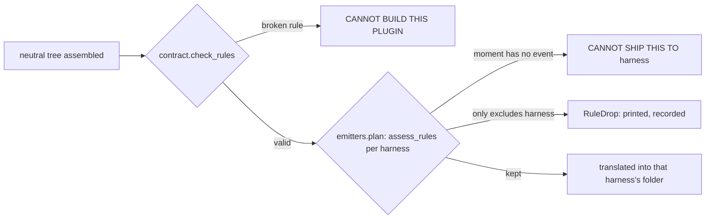

# ADR 0004: Two more hook moments, and a waiver that lives on the rule

**Status:** accepted (2026-08-09) · **Decided by:** Pi.
**Extends:** ADR 0003, which decided what Foundry emits and settled the neutral hook vocabulary at
four moments. Nothing in 0003 is superseded. This document is a partial reversal of one line in it:
0003 says a per-harness override block is absent from the manifest, and this admits one, but only at
the granularity of a single rule, never at the granularity of a kind.

## Verdict

- The neutral hook vocabulary grows from four moments to six: `session-start`, `before-tool`,
  `after-tool`, `turn-end`, `before-compact`, `session-end`, in that order.
- The original four stay the floor. `COMMON_MOMENTS` names them, and the framework refuses a
  hook-carrying harness that omits any one of them, or a harness that carries no hooks at all but
  names a moment anyway, calling either one a Foundry defect.
- A hook rule gains two keys. `only: [<harness>, ...]` names which harnesses carry that one rule;
  everywhere else it is a recorded, printed drop rather than a silent absence. `timeout: <seconds>`
  is a whole number greater than zero, carried straight into the Claude Code hook entry.
- Rule validation moved out of `claude_code.py` and into `contract.check_rules`, run once against the
  neutral tree before any per-harness folder is written, so a plugin whose only target prunes hooks
  entirely still finds out its hook file is broken.
- **`only` cannot take effect in any build running today.** `claude-code` is the only harness in the
  registry that carries hooks at all, so there is no second hook-carrying harness for a rule to be
  absent from, and no rule-level drop can occur on any plugin anyone builds right now. The key exists
  so the file format and the lock file record are settled before a second hook-carrying harness
  arrives, and so the loss policy is written once rather than under pressure when it does. That is
  the whole justification. It is not sold as more than that.

## A kind is a surface; a rule is one line, and only one of those gets an override

ADR 0003 refused a per-harness override block in the manifest outright: "A harness needing a field
the neutral form lacks is a refusal today." That refusal still stands for a kind. What changed is
narrower than it looks, because a kind and a rule are not the same size of thing.

A kind is a whole surface: `hooks`, `mcp`, `agents`. Overriding one per harness would let two
harnesses named in the same `targets` line carry visibly different packages under the same
manifest, and a reader could no longer tell what a plugin ships by reading its own declaration once.
That is the shape ADR 0003 protects, and this document leaves it exactly as it was: there is still no
`degrade.<harness>.override` or equivalent that changes what a kind means per harness.

A rule is one line inside `hooks/hooks.yaml`: one guard, naming one moment and one script. Naming
which harnesses carry that one guard does not hide a package's shape, because the rest of the
`hooks` surface, and every other kind, is unaffected. `only` therefore answers a narrower question
than a kind-level override ever could: not "what does this harness's package look like," but "does
this one guard run here."

| Pattern | Verdict | One line |
|---|---|---|
| `only` on the rule, naming the harnesses that carry it | use | A rule is one line; naming which harnesses carry it names a single guard, not a whole surface |
| `degrade.<harness>.drop: [hooks]`, reused to drop one rule while keeping the rest of `hooks` | rejected | `degrade` already means "this whole kind is gone from this harness." Reusing it for one rule needs a second, incompatible meaning for the same key, or it takes every other rule on that harness down with it, which is not what the author asked for |
| A per-harness override block at the kind level, in the manifest | still absent | ADR 0003's refusal stands. Two harnesses in the same `targets` line carrying visibly different surfaces is the exact opacity that refusal exists to prevent, and nothing here reopens it |

The rejected alternative was tried first, in the sense that it is the obvious shape: put the waiver
where every other kind-level waiver already lives. It fails for one reason, stated plainly because it
is the crux of the whole document: `degrade.<harness>.drop` is all-or-nothing on a kind. A plugin that
wants one rule to run only on Claude Code, while every other rule keeps running on every harness that
carries hooks, cannot say that with a kind-level key without giving up hooks everywhere else to get it.
The waiver has to live where the loss is, which is the rule, not a block that speaks for the whole
surface.

## Decisions

| Decision | Why |
|---|---|
| `MOMENTS` grows to six, in the fixed order `session-start`, `before-tool`, `after-tool`, `turn-end`, `before-compact`, `session-end` | Order is fixed here rather than left to a dictionary, because a folder's bytes sit inside its own `contents` fingerprint and a map that reordered itself would move that number for nobody. `turn-end` and `before-compact` are what Claude Code names today; no other registered harness has an event for either yet |
| `COMMON_MOMENTS` names the original four and stays the floor | Every harness with a hook surface already expressed these four under ADR 0003. Letting a harness claim hooks while quietly expressing fewer than four would be the same silent shrinkage the loss policy exists to forbid, so it is checked once, in the framework, and called a Foundry defect rather than a plugin problem |
| A `Capability` answers for moments the way it already answers for kinds | `check_moments` in `emitters/__init__.py` refuses a hook-carrying harness that names a moment outside `MOMENTS`, one that omits a common moment, and a non-hook harness that names any moment at all. Each is a Foundry defect: the gap is in Foundry's own module, not in anything a plugin author wrote |
| A hook rule may name `only: [<harness>, ...]` | The waiver for a rule-level loss. A rule naming it is carried by the harnesses it names and is a recorded, printed drop everywhere else, the same discipline `degrade` already applies to a kind, applied one line lower |
| `only` names a harness already in `targets`, or the build refuses | A waiver reserved for a harness nobody builds fires nowhere and reads as a rule somebody wrote. Refusing it is the same fault as `degrade` naming a harness outside `targets`, already refused before this change |
| A hook rule may name `timeout: <seconds>`, a whole number greater than zero | Some harnesses give a hook a default budget short enough to kill work the author meant to finish, and the only way to say otherwise is to name the number. Refused on anything that is not a positive whole number, because a timeout that cannot be reached is not a timeout |
| Rule validation moved to `contract.check_rules`, called once against the neutral tree in `build.py`, before any per-harness folder is written | It used to live inside `claude_code.py`, so a plugin whose only target pruned hooks entirely never had its hook file read at all. A rule written with `on` instead of `at`, or naming a file the plugin does not hold, shipped unnoticed until somebody added `claude-code` to `targets` months later, and the refusal then named a line the author had forgotten writing |
| A rule-level refusal carries its own heading, distinct from a kind-level one | `CANNOT BUILD THIS PLUGIN.` when the hook file itself is not a hook file yet: an unrecognised key, a moment outside the six, a `run` naming nothing, an `on` where `at` belongs. No choice of `targets` fixes this. `CANNOT SHIP THIS TO <HARNESS>.` when the file is fine and a named harness simply has no event for a moment a rule uses: fixed by dropping that harness from `targets`, or by scoping the rule with `only` |
| `foundry.lock.json` gains a `rules` list beside `dropped`, written only when it is non-empty | Same discipline as `dropped` already follows: a plugin using none of this keeps the exact bytes it produced before, because a lock file is part of the folder that ships |

## `only` has no effect in any build running today

Stated once more, because a reader skimming the table above could reasonably conclude the opposite.
`REGISTRY` in `emitters/__init__.py` names six harnesses. Of those, `agent-plugins` and `codex` say
"version 1.0.0 of Agent Plugins defines no hook component" and "no Codex hook event vocabulary has
been read from source"; `opencode` and `pi` say they have no declarative hook surface at all;
`instructions` says a prose file runs nothing. `claude-code` is the only harness left, and it is the
only one that carries hooks. A rule's `only` therefore always evaluates against a set of targets in
which at most one member can ever carry hooks in the first place, so `rules_for` never has a second
harness to drop a rule from, and `assess_rules` never reaches its refusal or its `RuleDrop` branch on
any plugin building today.

The key is not dead weight for that reason. It exists so that the day a second hook-carrying harness
is registered, the manifest key, the check in `contract.check_rule`, the lock file's `rules` list and
this document's decision are already in place, read, and agreed to. The alternative is writing all of
that the week a second harness lands, under the pressure of a real plugin author who wants one rule to
keep running somewhere while a second harness that cannot yet express it comes online. Settling the
shape now, while it changes nothing anyone can observe, is cheaper than settling it then.

## Structure

`check_rules` runs once, before the harness loop. Everything after it is per harness, and a rule that
survives validation is either kept, refused for one harness's missing event, or dropped by its own
`only`.

| Part | Owns | Must not |
|---|---|---|
| `contract.check_rule` / `check_rules` | Whether a rule is well-formed against the six-moment vocabulary and the five keys, checked on the neutral tree | Know which harness is being built, or decide whether a moment has an event on one |
| `emitters/__init__.py`'s `assess_rules` | Whether a well-formed rule's moment has an event on this harness, and whether `only` carries it here | Validate the rule's shape a second time, or decide loss for a kind |
| `emitters/claude_code.py`'s `translate_hooks` | Writing the kept rules into `hooks/hooks.json`, in the six-moment order | Validate anything, or decide which rules it receives |

## Consequences

- A plugin can now say "this one guard is Claude-Code-only" without giving up hooks anywhere else,
  which was not expressible before this change: the only prior waiver was `degrade.<harness>.drop`,
  and dropping `hooks` there took every rule with it.
- A rule's shape is checked earlier than before. A plugin building only `opencode` or `pi`, which
  prune hooks entirely, now finds a broken `hooks/hooks.yaml` at build time instead of never finding
  it, because `check_rules` runs before pruning rather than inside the one emitter that used to read
  hooks.
- The lock file format grows a field that most plugins will never populate. `rules` is written only
  when non-empty, so a plugin using none of this produces the exact bytes it produced before this
  change, the same discipline `dropped` already follows.
- `only` and `timeout` are dead code paths for loss purposes until a second hook-carrying harness is
  registered. They are exercised today only by validation, never by an actual drop in a real build.

## What these decisions make impossible

| Previously possible | Foreclosed by |
|---|---|
| A hook-carrying harness quietly expressing fewer than the four common moments | `check_moments` refuses any hook-carrying `Capability` missing one of `COMMON_MOMENTS`, calling it a Foundry defect |
| A non-hook harness's `Capability` naming a moment nobody can act on | `check_moments` refuses a `Capability` that names moments while saying it cannot carry hooks |
| A plugin author giving up hooks on every harness to keep one rule scoped to Claude Code | `only` waives one rule, not the whole `hooks` kind, so the rest of the surface keeps shipping everywhere it did before |
| A broken hook rule surviving a build because the only target named prunes hooks before anything reads the file | `contract.check_rules` runs on the neutral tree before any harness folder, hook-carrying or not, is written |
| A rule-level drop happening without being printed and written into the lock file | `assess_rules` returns a `RuleDrop` for anything `only` excludes, and `write_lock` records it under `rules` exactly as `dropped` already records a kind-level loss |

## Still open

| Item | Status | Evidence |
|---|---|---|
| Whether a second hook-carrying harness is ever registered | open. Nothing in this document commits Foundry to adding one; it only settles the format for when one arrives | `REGISTRY` in `emitters/__init__.py` names `claude-code` as the sole carrier of `hooks` today |
| Whether a kind-level per-harness override is ever revisited | open, and unaffected by this document. ADR 0003's refusal of one still stands | ADR 0003, "A per-harness override block in the manifest: absent" |
| Whether `timeout` needs a per-harness ceiling once a second hook-carrying harness exists | open. Today the value passes straight into the Claude Code hook entry with no upper bound checked against any client's own limit | `translate_hooks` in `scripts/emitters/claude_code.py` |
