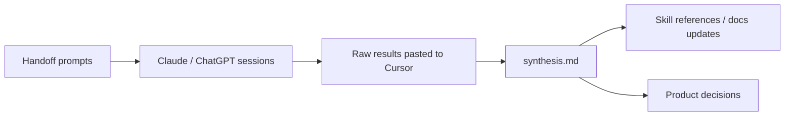

# Research

Exploratory research that informs skills and products — landscape analyses, validation studies, community discourse, competitive mapping. **Not shipping code.**

Product design docs (checklists, glossaries, shipped architecture) stay in [`docs/`](../docs/). Ephemeral plans, audits, and handoffs go in **`.gitignored/`** (local). **Distilled findings** that agents need at invoke-time go into skill references.

## Layout

```
research/
├── README.md                 this file — conventions
├── _templates/               reusable prompts (generic scout, paste template)
└── <topic>/                  e.g. manifold, orchestrator
    └── <study-name-YYYY-MM>/ handoffs, raw results, synthesis
        ├── README.md           study index + status (start here)
        ├── 00-MASTER-HANDOFF.md
        ├── 01-session-*.md
        ├── results/          raw pasted outputs from external sessions
        └── synthesis.md      final report
```

## Lifecycle



1. **Handoff** — prompts in `research/<topic>/<study>/`
2. **Collect** — run external sessions; paste into Cursor (or save under `results/`)
3. **Synthesize** — one `synthesis.md` per study (Cursor or manual)
4. **Distill** — update skill `references/`, `docs/`, or manifold DB if actionable
5. **Archive** — study folder stays; don't delete raw results (provenance). Mark complete in study `README.md`.

## Naming

| Pattern | Example |
|---|---|
| Topic folder | `manifold/`, `orchestrator/` |
| Study folder | `landscape-2026-06/`, `mcp-ecosystem-2026-07/` |
| Synthesis output | `synthesis.md` or `synthesis-2026-06-08.md` if re-run |

## When to use a separate repo

Stay in **this repo** until one of these is true:

- Research volume rivals code (handoffs + raw results > ~50MB or cluttering git history)
- You need **private research / public skills** split
- Research spans many unrelated domains beyond agent-skills

Then create e.g. `agent-skills-research` and link findings back via URLs or distilled markdown in skill references.

## Active studies

| Study | Status | Entry |
|---|---|---|
| Manifold landscape | **Complete** · [`synthesis.md`](manifold/landscape-2026-06/synthesis.md) | [`manifold/landscape-2026-06/README.md`](manifold/landscape-2026-06/README.md) |
| Claude Code ecosystem | **Complete** (imported) | [`claude-code/ecosystem-2026-05/README.md`](claude-code/ecosystem-2026-05/README.md) |
| Orchestrator harness refresh | **Complete** · [`synthesis.md`](orchestrator/harness-refresh-2026-06/synthesis.md) | [`orchestrator/harness-refresh-2026-06/README.md`](orchestrator/harness-refresh-2026-06/README.md) |
| Manifold human output (Topic K) | **Complete** · [`synthesis.md`](manifold/human-output-2026-06/synthesis.md) | [`manifold/human-output-2026-06/README.md`](manifold/human-output-2026-06/README.md) |
| Crucible (hat wardrobe + review benchmark) | **Complete (v1)** · shipped to `plugins/crucible/` | [`crucible/README.md`](crucible/README.md) |

## Completed studies

Studies remain in place for provenance. Distillation into product docs and skill references happens outside `research/`.

| Study | Completed | Deliverable |
|---|---|---|
| Manifold landscape (2026-06) | 2026-06-06 | [`synthesis.md`](manifold/landscape-2026-06/synthesis.md) |
| Claude Code ecosystem (2026-05) | 2026-06-07 | Seven-part field guide — [`claude-code/ecosystem-2026-05/`](claude-code/ecosystem-2026-05/) |
| Orchestrator harness refresh (2026-06) | 2026-06-07 | [`synthesis.md`](orchestrator/harness-refresh-2026-06/synthesis.md) — §10 lists gaps before skill design |
| Manifold human output / Topic K (2026-06) | 2026-06-07 | [`synthesis.md`](manifold/human-output-2026-06/synthesis.md) — v1 `status-brief` tri-surface spec |

## Templates

Copy from [`_templates/`](_templates/) when starting a new study, or duplicate an existing study folder and replace topic-specific seeds.
