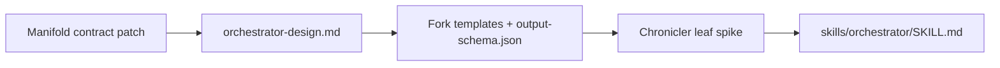

# Orchestrator harness refresh synthesis (2026-06)

**Study complete.** Reconciles the May 24 orchestrator v0.1 contract with the imported Claude Code ecosystem research (`research/claude-code/ecosystem-2026-05/`) and the June manifold landscape positioning.

**Index:** [`README.md`](README.md) · **Harness research:** [`../claude-code/ecosystem-2026-05/`](../claude-code/ecosystem-2026-05/)

---

## 1. Executive summary

The May orchestrator design is **architecturally sound but harness-stale**. The runner-not-daemon reframe, two-axis state model, fail-loud schema, handoff addendum, and manifold partnership all survive scrutiny. What rotted in six weeks is everything that touches **Claude Code's moving surface**: model IDs (Opus 4.8), effort defaults (`high` not `xhigh`), skill activation mechanics (hooks, not descriptions), context/compaction behavior, and Anthropic's new **Dynamic Workflows / `ultracode`** layer.

The landscape synthesis (Session D) and this harness refresh converge on one scope line:

> **Custom orchestrator owns durable execution over manifold leaves — queue, leases, writeback, cockpit, handoff schema. It does not rebuild Claude Code's in-session parallel fan-out.**

Dynamic Workflows is a **leaf-dispatch mode**, not a substitute for the orchestrator runner. Manifold remains the **intent broker**; the orchestrator is the **render-farm queue** that realizes leaves and writes verdicts back.

**Three material contract changes** fall out of this refresh:

1. **Pull resource selection forward** — model/effort per dispatch was deferred to Phase 3; the research in `03`/`04` is ready now and belongs in the **skill + dispatch templates**, not a later runner phase.
2. **Partial hooks reversal** — keep "no plugin hooks API in Phase 1," but add **two concrete PreToolUse/SessionStart hooks** in the orchestrator skill for skill-evaluation and schema enforcement; research treats instruction-only guarantees as a known failure mode.
3. **Reconcile with Opus 4.8 honesty** — the handoff schema and `assumptions_made[]` auto-downgrade align with 4.8's reliability story; lean into them as the orchestrator's trust layer, not optional polish.

**Immediate unblock:** write `docs/orchestrator-design.md` from May HTML §7 + addendum + sections 4–7 below. Do not implement Phase 1 against archived `plan-orchestrator` without applying the skill deltas in section 5.

---

## 2. Contract audit (May v0.1 vs harness research)

Legend: **✅ confirmed** · **🟢 confirmed with update** · **🟠 stale** · **🔴 contradicts** · **⚪ unchanged / out of scope**

| # | May v0.1 decision | Verdict | Research basis | Action |
|---|---|---|---|---|
| 1 | Runner not daemon (`orchestrator run`, exits on budget/time/queue) | ✅ | `06` mobile stack assumes attachable long runs, not 24/7 polling | Keep |
| 2 | Skip Stage 0 bash spike; web UI in Phase 1 | ✅ | `06` — remote monitoring via Tailscale + web/cockpit is load-bearing for Pi's workflow | Keep (user decision stands) |
| 3 | Separate SQLite DB + six tables + append-only phase rows | ✅ | `02` — crash recovery, idempotency still required regardless of harness | Keep |
| 4 | Two orthogonal axes (lifecycle × outcome) | ✅ | `01` — plan→verify workflow maps cleanly to lifecycle states | Keep |
| 5 | Mandatory output schema + `assumptions_made[]` auto-downgrade | 🟢 | `03` — Opus 4.8 honesty gain is the operational reason this matters for long runs | Keep; cite 4.8 in design doc rationale |
| 6 | Handoff addendum (`narrative_handoff`, `where_to_look`, etc.) | ✅ | `01`/`02` — plan-first + verification + structured wrap-up is community consensus | Keep as P0 |
| 7 | No hooks contract in Phase 1 | 🟢 | `01`/`02` — hooks are the documented escape hatch for guarantees; skill activation ~50% without forced-eval hook | **Narrow exception:** ship orchestrator-owned hooks in skill, not a general plugin API |
| 8 | No web UI / MCP in Phase 1 (HTML §7) | 🔴 | User overrode: web UI Phase 1 (May 2026 decisions) | Already decided — design doc must say web UI Phase 1 |
| 9 | Manifold contract: structured verdicts + fencing + idempotency | 🟠 | Still blocking; manifold v1.0 shipped landscape work but these three additions may remain open | Verify manifold codebase; plan patch before orchestrator Phase 1 |
| 10 | Phase 3: model/effort resource selection | 🟠 | `03`/`04`/`archive/state-of-claude-may-2026-baseline.md` — work is done | **Move to Phase 1 skill layer** (section 6) |
| 11 | Architect = Opus; Haiku alignment; Opus judgment | 🟢 | `03` effort matrix + `02` red/blue on Haiku tool-call risk | Update model strings + effort levels (section 6) |
| 12 | ORIENT every cycle; externalize state to disk | ✅ | `01` — context rot; architect must not accumulate lint output | Keep; add proactive compact guidance for architect session |
| 13 | Progress-tracker MCP for subagent visibility | ✅ | `01` — subagents in isolated context; MCP progress is out-of-band state | Keep |
| 14 | "Claude routes skills" (structure iii-C) | 🟢 | `02` — skill descriptions alone plateau ~50%; forced-eval hook needed for reliability | Keep routing; add hook-backed skill gate for critical dispatches |
| 15 | plan-orchestrator five-stage DAG ceremony | 🟢 | Still valid for multi-day cross-component work; overkill detector still applies | Port to `skills/orchestrator/` with harness updates |
| 16 | Build custom parallel orchestration | 🔴 | `03` Dynamic Workflows / `ultracode`; `05` 12+ orchestrators exist | **Do not compete** — delegate in-session fan-out to CC native mode (section 4) |
| 17 | Manifold = partner, not embedded schema | ✅ | Landscape Session D — intent-broker, MCP graph | Keep; orchestrator consumes `next-leaves`, writes verdicts |
| 18 | Quality signals: ship real metrics only | ✅ | `02` — distrust aggregate "health" gauges | Keep |
| 19 | Wall-clock timeouts (runner-enforced) | ✅ | `03` — `task_budget` prevents cost blowout; timeouts are complementary | Keep; document `task_budget` in dispatch template |
| 20 | `.env` / secrets via permission denies | 🟢 | `02` §3.7 — denies are defense-in-depth, not guarantee | Add to skill security section; prefer managed denies for orchestrator runs |

---

## 3. Build vs native — scope decision

### What Anthropic now ships (May 30 research)

| Native capability | What it does | Source |
|---|---|---|
| **Dynamic Workflows** | Plan → hundreds of parallel subagents → verify → report (research preview, Team/Enterprise/Max) | `03` |
| **`ultracode`** | Session-only: `xhigh` + standing permission for Dynamic Workflows via mid-task system messages | `04` |
| **`opusplan`** | Opus plans at 200K, Sonnet executes | `01`, `03` |
| **Explore subagent** | Haiku 4.5 by default for read-only exploration | `03` baseline report |
| **Agent Teams / Task tool** | In-session subagent dispatch inside one Claude Code process | `01`, `05` |

### What custom orchestrator still owns

| Custom layer | Why native doesn't replace it |
|---|---|
| **Manifold leaf queue** | No CC feature reads `next-leaves` or writes structured verdicts + `change_reason` back |
| **Durable job state** | CC sessions are ephemeral; orchestrator DB survives crash, retry, cancel |
| **Cross-session runner** | `orchestrator run --max-budget --max-time` across hours/days away from keyboard |
| **Cockpit / web UI** | CC has Remote Control preview (`06`) but not manifold-integrated DONE panel with handoffs |
| **Handoff schema enforcement** | CC doesn't enforce `narrative_handoff` / `deliberately_not_done[]` at the wire |
| **Writeback verification** | Read-back after manifold update with fencing/idempotency |
| **Progress-tracker integration** | Cross-dispatch audit trail in separate MCP DB |

### Decision table

| Work unit | Dispatch mode | Rationale |
|---|---|---|
| **Single manifold leaf** (one realization, bounded scope) | Claude Code session with pinned model/effort from routing table | Cheapest path; runner invokes `claude` with leaf context + output schema |
| **Leaf needing wide parallel exploration** inside one repo | Same session + `/effort ultracode` or Dynamic Workflows **if** plan on Max/Team/Ent | Native fan-out; orchestrator waits for structured return, does not reimplement worker pool |
| **Multi-component DAG** (plan-orchestrator ceremony) | Orchestrator skill as architect + layered dispatches | Matches archived skill; manifold optional until leaves exist |
| **Architect ORIENT cycle** | Dedicated Opus 4.8 session, `high`/`xhigh`, externalized state files | `01` — never hold lint/orient output in conversation |

**Explicit non-goals for v0.1:** reimplementing CC's subagent scheduler, competing with Factory/Cursor cloud agents, or holding the spec graph internally.

---

## 4. Skill deltas (`archived/plan-orchestrator` → `skills/orchestrator/`)

Apply these when authoring the new skill. Treat `02-claude-code-index-redblue-review.md` as the errata sheet for `01`.

### 4.1 Architect preconditions (update)

| Was (archived skill) | Should be |
|---|---|
| "Architect model: Opus. Refuse Haiku; warn on Sonnet." | **Opus 4.8** (`claude-opus-4-8`). Refuse Haiku for architect. Sonnet allowed only for bounded planner dispatches, never ORIENT. |
| Implicit Opus 4.6 as flagship | Pin **`claude-opus-4-8`**; note 4.7 strings are legacy |
| No effort guidance | Architect ORIENT/planning: **`xhigh`** default; **`max`** for single planning turns only (does not persist). See section 6. |

### 4.2 Verification toolbox (update)

| Class | Was | Should be |
|---|---|---|
| **Structural** | Scripts | Unchanged |
| **Alignment** | Haiku claim/coverage checks | Haiku 4.5 at **`low`** effort; **never** free-running implementer loops on Haiku (`03`, `02` §3.2) |
| **Judgment** | Opus edge review / assumption sweep | Opus 4.8 at **`high`** or **`xhigh`**; security/architecture leaves at **`xhigh`** minimum |

Add red/blue errata callouts in skill footnotes:
- Auto-compact threshold varies (~76–95%); **`CLAUDE_AUTOCOMPACT_PCT_OVERRIDE` may move threshold both ways** (`02` §3.6) — architect should compact proactively at ~60–70% (`01`).
- Skill activation percentages in old docs are **weakly sourced**; for orchestrator-critical skills, use **forced-evaluation PreToolUse hook** (`02` §3.2).

### 4.3 Context engineering (add section)

From `01`/`02`, bake into orchestrator skill:

1. **Orchestrator skill body stays lean** — procedures live in `references/` loaded on demand (same pattern as `skills/manifold/`).
2. **Per-run work-dir is the index** — `TODO.md`, `orient-latest.md`, `dag.md`; do not restate in CLAUDE.md.
3. **Before `/clear` between stages** — write 3–5 line brief to `learnings.md` or stage handoff file (`01`).
4. **Subagents return summaries only** — full output schema JSON + `narrative_handoff`; never paste raw lint logs upstream.
5. **Instructions are context, not config** — HALT/SURFACE rules in subagent protocol stay; **runner validates JSON schema**, not prose compliance.

### 4.4 Hooks (narrow Phase 1 exception)

May synthesis deferred hooks API. Research mandates **two orchestrator-specific hooks** in `.claude/settings.json` (project or managed):

| Hook | Purpose |
|---|---|
| **PreToolUse — Skill tool** | Force explicit evaluation when dispatch matches orchestrator leaf patterns (adapt pattern from `02` §3.2 forced-eval hook) |
| **PostToolUse or Stop — schema check** | Reject dispatch return missing required schema fields before architect marks phase DONE |

This is not a general plugin system — it is the minimum to make "fail loud" enforceable beyond `skill.md` prose.

### 4.5 Handoff schema (keep addendum, extend enforcement)

Keep all addendum fields. Add to skill:

- Minimum **`narrative_handoff`**: ≥1 concrete win with numbers, ≥1 `where_to_look` entry, branch state if code touched.
- **`deliberately_not_done[]`**: required when `verdict=achieved` and scope was trimmed.
- Persist **`session_transcript_path`** + **`session_id`** on every dispatch (addendum §implementation).

Aligns with Opus 4.8 honesty narrative (`03`) — vacuous handoffs are the pre-4.8 failure mode.

### 4.6 Security (add)

From `02` §3.1, §3.7:

- Sandbox reduces prompts, **not** a hard boundary — document VM/devcontainer for credential-bearing runs.
- **`permissions.deny: Read(./.env)`** in managed settings; do not trust `.claudeignore` alone.
- Two different "84%" figures — permission reduction vs injection success rate; never conflate in docs.

### 4.7 Drop or defer

| Item | Reason |
|---|---|
| `ultrathink` keyword-only guidance | Superseded by effort dial; keep one line pointing to effort docs |
| Skill activation "20%→90%" claims | Remove; replace with hook-backed activation |
| Opus 4.6/4.7 as "newest model" anywhere | Global find-replace |

---

## 5. Runner and cockpit deltas

### 5.1 Phase map (revised)

| Phase | May HTML | After refresh |
|---|---|---|
| **Stage 0** | Bash spike | **Skipped** (user decision) |
| **Phase 1** | CLI runner, no web UI | CLI runner **+ web UI cockpit** + manifold writeback |
| **Phase 2** | Hooks, retry, dashboard | Priority/retry/cross-cutting verification; **general hooks API** still deferred |
| **Phase 3** | Resource mgmt, parallelism | **Resource routing moves to skill**; Phase 3 = worktree parallelism + smart dispatch rules only |

### 5.2 Dispatch envelope (new — runner responsibility)

Every leaf invocation should pass a structured envelope (CLI flags or prompt preamble):

```yaml
leaf_id: "<manifold node id>"
model: "claude-opus-4-8" | "claude-sonnet-4-6" | "claude-haiku-4-5-20251001"
effort: "low" | "medium" | "high" | "xhigh" | "max"  # max = single turn only
dispatch_mode: "standard" | "opusplan" | "ultracode"  # ultracode when native fan-out earned
task_budget: "<tokens or usd cap for unattended>"
output_schema: "<path to JSON schema>"
manifold_fencing_token: "<from peek/update>"
idempotency_key: "<uuid>"
```

Runner enforces `task_budget` and wall-clock timeout **regardless of model honesty**.

### 5.3 Cockpit DONE panel (unchanged intent, richer rationale)

Expandable row per completed leaf:
- Render `narrative_handoff` markdown
- Link `handoff_doc_path`, transcript path, session id
- Badge `needs_review` when assumptions non-empty OR handoff vacuous (addendum rules)

Remote access pattern from `06`: bind web UI to `127.0.0.1`, expose via Tailscale Serve — same as manifold-web pattern.

### 5.4 Manifold integration (unchanged contract, verify implementation)

Still required before Phase 1 execution:

1. Structured verdict failure data (expected/actual/diff)
2. Fencing tokens on `update-node`
3. Idempotency keys on `update-node`

**Action:** audit `packages/manifold/` for these three; if missing, ship as manifold patch (version TBD) before orchestrator Phase 1.

---

## 6. Model and effort routing table (Phase 3 → Phase 1)

Canonical source: `research/claude-code/ecosystem-2026-05/03-state-of-claude-may30-update.md` + `04-state-of-claude-effort-and-context-addendum.md`.

| Orchestrator role | Model | Effort | Notes |
|---|---|---|---|
| **Architect ORIENT / gates** | Opus 4.8 | `xhigh` | Externalize state; compact at ~60–70% context |
| **Framing / DAG / skeptic** | Opus 4.8 | `xhigh` | Plan-mode-first habit from `01` |
| **Phase planner** | Opus 4.8 or Sonnet 4.6 | `high` → escalate `xhigh` on ambiguity | Sonnet viable when contracts locked |
| **Edge reviewer / assumption sweep** | Opus 4.8 | `high` / `xhigh` | Judgment class |
| **Haiku alignment checks** | Haiku 4.5 | `low` | Bounded Q&A only |
| **Implementer (single leaf)** | Sonnet 4.6 | `medium`–`high` | Default worker tier |
| **Explore / repo scan subagent** | Haiku 4.5 | `low` | CC default Explore pattern |
| **Security / architecture leaf** | Opus 4.8 | `xhigh`; `max` for planning turn only | Honesty-critical |
| **Long unattended leaf queue** | Opus 4.8 orchestrates | `xhigh` + **`task_budget`** | Consider `ultracode` if Max/Team/Ent |
| **Interactive cockpit triage** | Opus 4.8 Fast Mode | `/fast` | Latency-bound human-in-loop |

**Default barbell unchanged:** Sonnet 4.6 for most implementation, Opus 4.8 deliberate, Haiku 4.5 only under plan with validation.

**Context cliff:** Haiku capped at 200K — disqualify for leaves whose context envelope exceeds 200K (`04`).

---

## 7. Ordered action list

### Before `docs/orchestrator-design.md`

1. **Read this synthesis** + May HTML §7 + addendum (30 min).
2. **Audit manifold** for fencing / idempotency / structured verdicts — file gaps as blocking tasks.

### Writing `docs/orchestrator-design.md`

3. Extract May §7 contract into markdown sections: substrate, fail-loud schema (+ handoff fields), observability, CLI, web UI, manifold writeback.
4. Insert **§ Build vs native** from section 4 above — explicit non-goals.
5. Insert **§ Dispatch envelope** and **§ Model/effort routing** from sections 5.2 and 6.
6. Document **narrow hooks exception** (section 4.4) under fail-loud enforcement.
7. Update all model/version references to Opus 4.8 era.
8. Cross-link landscape synthesis: orchestrator = render-farm queue; manifold = intent broker.

### Before `skills/orchestrator/`

9. Fork `archived/plan-orchestrator/` → `skills/orchestrator/` applying section 4 deltas.
10. Add `references/harness-2026-06.md` — distilled routing table + red/blue errata (not full research dump).
11. Add `references/output-schema.json` — mandatory fields including handoff addendum.
12. Sync example `.claude/settings.json` snippet for orchestrator hooks.

### Before orchestrator Phase 1 implementation

13. Ship manifold contract patch if audit finds gaps.
14. Write `orchestrator-phase-1-plan.md` with web UI in wave 1 (not deferred).
15. Spike one chronicler leaf end-to-end: `next-leaves` → dispatch envelope → structured return → manifold writeback → cockpit row.

### Explicitly do not do yet

- General hooks plugin API (Phase 2+)
- Competing with Dynamic Workflows worker pool
- Distilling full research into skill body (use `references/` progressive disclosure)
- Apple MCP (`07`) or mobile voice (`06`) — unrelated to orchestrator core

---

## 8. Research doc weighting (for future refresh)

| Doc | Weight for orchestrator |
|---|---|
| `01` index | **Primary** — skill/context/subagent design |
| `02` red/blue | **Primary** — errata and enforcement |
| `03` + `04` state/effort | **Primary** — routing table |
| `05` harness landscape | **Strategic** — positioning only |
| `06` mobile | **Cockpit access** — Tailscale/web UI |
| `07` Apple MCP | **Ignore** for orchestrator v0.1 |
| `archive/state-of-claude-may-2026-baseline.md` | **Provenance** — diff against `03` |

---

## 9. Closing alignment check

The May vision ("autonomous realization, fail loud, step away, cockpit calm") remains valid. The harness refresh changes **how** leaves get dispatched and **what** guarantees are technically enforceable — not **why** the orchestrator exists.

Manifold landscape Session D said don't build another orchestrator **platform**. This design complies: the custom runner is a **leaf realization queue with writeback discipline**, consuming manifold over MCP, optionally delegating in-session parallelism to Claude Code native tools.

**Next artifact:** `docs/orchestrator-design.md` — use this file as the delta overlay on May HTML §7.

---

## 10. What's missing for orchestrator skill design

This synthesis closes the **harness research gap**. It does **not** close the **skill design gap**. The items below are still absent from the repo and must exist (or be spiked) before `skills/orchestrator/` is shippable.

### What research already covers (sufficient to start)

| Area | Source |
|---|---|
| Harness mechanics (context, skills, hooks, subagents) | `claude-code/ecosystem-2026-05/01`, `02` |
| Model/effort routing (Opus 4.8 era) | `03`, `04` |
| Orchestrator v0.1 contract + handoff schema | May HTML §7, addendum, harness refresh §2–6 |
| Build-vs-native scope line | Harness refresh §4 |

### Gaps — blocking or high-risk if skipped

| # | Missing artifact | Why it matters | Suggested owner |
|---|---|---|---|
| 1 | **`docs/orchestrator-design.md`** | Single authoritative spec: when the skill fires, phases, runner boundary, manifold writeback, web UI. Synthesis is a delta overlay, not the design doc. | Design doc pass |
| 2 | **`skills/orchestrator/SKILL.md`** | Lean invoke body with progressive disclosure — not written. | Fork from `archived/plan-orchestrator/skill.md` + §4 deltas |
| 3 | **`references/output-schema.json`** | Mandatory return fields (`verdict`, handoff addendum, auto-downgrade rules) at the wire, not in prose. | Skill artifacts |
| 4 | **`references/harness-2026-06.md`** | Distilled routing table + red/blue errata for agents at invoke-time. | Skill references |
| 5 | **Dispatch prompt templates** | `archived/plan-orchestrator/templates/` not forked or updated for Opus 4.8 / effort / dispatch envelope. | Skill templates |
| 6 | **Example hooks snippet** | PreToolUse skill-gate + schema-check `.claude/settings.json` — research mandates hooks for guarantees; no concrete config checked in. | Skill + docs |
| 7 | **Manifold contract patch** | Fencing tokens, idempotency keys, structured verdict failures — **not in `packages/manifold/`** (verified absent). Skill can describe writeback; safe orchestration cannot ship without this. | Manifold package |
| 8 | **Runner ↔ skill boundary diagram** | Unclear invoke path: user calls `/orchestrator` vs `orchestrator run` spawns Claude with skill loaded; who injects dispatch envelope (`model`, `effort`, `task_budget`, fencing token)? | Design doc |
| 9 | **Realizer sub-skill spec** | May design says realizer is a sub-skill. No separate spec for **one manifold leaf** vs **full DAG ceremony** — two different invocation paths, one skill body. | Design doc + skill routing |
| 10 | **Progress-tracker integration spec** | Archived skill assumes MCP registered. Missing: tool calls per dispatch phase, error shapes when MCP absent, HALT rules in subagent protocol. | Design doc + skill |
| 11 | **End-to-end spike (chronicler leaf)** | No traced example: `next-leaves` → dispatch → structured return → manifold writeback → cockpit row. Research validates patterns; one walkthrough exposes template gaps. | Spike doc or `research/` addendum |
| 12 | **Skill triggering strategy** | Research (`02`) — descriptions alone ~50% activation; hooks improve reliability. No decision on keywords, slash command, `disable-model-invocation`, PreToolUse hook combo. | SKILL.md frontmatter + hooks |
| 13 | **Manifold vocabulary cross-link** | Orchestrator calls manifold constantly. No doc tying skill language to [`docs/manifold/glossary.md`](../../../docs/manifold/glossary.md) and `skills/manifold/references/`. | Skill references |
| 14 | **`docs/orchestrator-design.md` § web UI** | User locked web UI in Phase 1; May HTML §7 said CLI-only Phase 1. Design doc must reconcile — not yet written. | Design doc |

### Recommended sequence (research → skill)



1. Ship manifold fencing / idempotency / structured verdicts.
2. Write `docs/orchestrator-design.md` (May §7 + this synthesis + runner/skill boundary).
3. Fork templates, `output-schema.json`, hooks snippet.
4. Document one chronicler-leaf end-to-end spike.
5. Author `skills/orchestrator/SKILL.md` last — after the spike proves the shape.

### Explicitly out of scope for skill v0.1

- General hooks plugin API (Phase 2+)
- Reimplementing Dynamic Workflows worker pool
- Full research dump in skill body (use `references/`)
- Apple MCP (`07`) or mobile voice (`06`)
