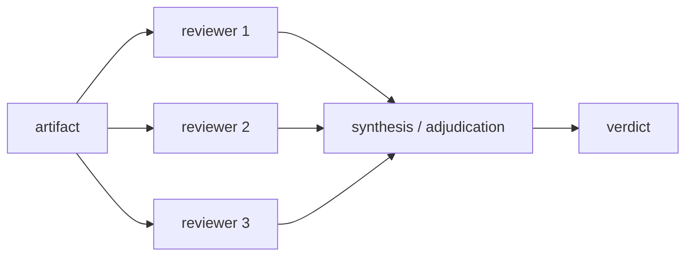

# Crucible Methodology

**Every crucible design choice cites a graded decision (D1–D17) from a verified evidence review**, so topologies rest on findings, not intuition.

> **Status:** stable

## What the evidence supports

**Adversarial and multi-perspective review of artifacts measurably beats single-reviewer and self-critique baselines** — with two hard qualifiers:

- **Lens diversity is the load-bearing ingredient.** Identical-role panels gain nothing over a single reviewer; N copies of one reviewer are worthless.
- **This is not a generic accuracy booster.** It does not reliably beat compute-matched self-consistency. The value case is *diverse, structured, evidence-cited findings on an artifact* — not raw ensemble accuracy.

Caveat: nearly all quantified evidence is answer-selection on QA/reasoning benchmarks. Critique of long-form plans and code is an extrapolation — treat protocol parameters as tunable defaults, not laws.

## Load-bearing decisions

| # | Decision | Confidence |
|---|----------|-----------|
| **D1** | Use external reviewers; never rely on self-critique | HIGH |
| **D3** | Lenses must be genuinely distinct | MEDIUM |
| **D4** | First pass is blind and parallel; reviewers commit before seeing peers; default to stubborn | HIGH |
| **D5** | 3–4 reviewers, one review round + one synthesis pass | HIGH |
| **D7** | Blue is a verifier, not a second attacker | LOW (precedent) |
| **D9** | Adversarial review is precision-biased — completeness needs an explicit guard | MEDIUM |
| **D10** | Adjudication is separate from both reviewers; the author may reject | LOW |
| **D11** | Topology: parallel-blind first pass, adjudicated synthesis second | MEDIUM |

## The load-bearing shape

**Blind-parallel-then-adjudicate is the defensible hybrid.** Blind parallelism guards against sycophantic conformity (weak reviewers self-correct only 3.6% of the time under a wrong majority); a single downstream synthesis pass is the only place cross-reviewer information flows.

## The precision-bias guard

**Adversarial review is optimized for precision, not recall.** One study saw requirements analysis *degrade* −7.5% and completeness fall 4.4→2.8 under a triangular adversarial system. So blue (or synthesis) runs a mandatory coverage check, and exhaustiveness-oriented artifacts (requirements, checklists, inventories) route to a panel with a dedicated coverage lens instead of an attack pair.

## A hat is a contract, not a character (D12–D17)

**A hat is a checklist-contract with a thin domain header — not a persona.** Identity personas alone are null-to-harmful (162 roles × 9 models: no accuracy gain; irrelevant persona detail drops performance up to ~30pp). What carries effect: task-coupled framing, binary-checkable criteria, and evidence-before-severity ordering.

- **D13** — Strip names, backstories, demographics, "world-class" flattery; every non-task-relevant word is downside exposure.
- **D14** — Free-prose analysis first, structured findings last; never verdict-first.
- **D15** — Shared anchored severity taxonomy; severity is assigned only after the evidence field is filled.
- **D16** — Distinctness is *measured* (overlap eval + no-persona control), never asserted; prefer cross-model diversity where feasible.
- **D17** — Personas drift within ~8 turns; re-inject the hat in long `consult` sessions (fresh-subagent dispatches are immune).

## See also

- [Overview](overview.md) — how these decisions map to the four entry points.
