# Guardrails Overview

**Guardrails are the defense-in-depth layer that keeps a compromised Claude session from escalating.** Claude Code has real file-write, Bash, and settings-edit power; the guards contain it.

> **Status:** stable

## Adversary model

**The adversary is a prompt-injected or rogue Claude — not the user.** The user sits *outside* the trust boundary; guards exist so a confused or hijacked session cannot silently escalate.

- **Primary:** a session that reads credentials, lifts its own restrictions, writes persistence, or pipes remote code to a shell.
- **Secondary:** accidents during autonomous sub-agent work — a sub-agent that generates then immediately runs its own script, or edits the hook layer to unblock itself.

Because a guard cannot tell a valid instruction from an injected one, it keeps the human in the loop for high-risk categories even when the request looks legitimate.

## Core principles

- **Defense-in-depth, not user-discipline.** Guards work even when the user isn't watching. A control that only fires when the user "forgets" is a reminder, and reminders fail under load.
- **The enforcement layer is immutable from within a session.** `settings.json`, `hooks/*`, and `bin/*` cannot be edited by Claude in the same session that might benefit — only by the user, outside Claude.
- **Every surviving prompt must be meaningful.** Guards that fire on routine safe actions train reflexive approval and erode the signal of real prompts.
- **Secrets never enter context.** Credentials are out of scope for Claude operations entirely.

## Permission precedence: deny beats allow

**The engine evaluates `deny` before `allow`, regardless of specificity.** An allow can never carve an exception from a deny; narrowing a restriction means *editing the deny*, not adding an allow. Additive allows are always safe; deny changes require explicit coverage proofs.

The rule stack, most to least permissive:

| Layer | Behavior |
|-------|----------|
| Explicit deny (settings.json) | Hard-refuse, no prompt |
| Hook hard-deny | Hard-refuse with explanation |
| Hook ask | Surface to user, await approval |
| Explicit allow (settings.json) | Run without prompting |
| `autoAllowBashIfSandboxed` | Unmatched Bash runs; sandbox is containment |

## Why hooks, not just deny rules

**The permission engine splits composite commands on `|`, `&&`, `;`, `||` before matching**, so it cannot reason about pipelines, operator chains, or argument position. Anything needing those must live in a PreToolUse hook that sees the unmodified command string — see [permission-pipe.md](permission-pipe). Simple prefix patterns stay as deny rules.

```mermaid
graph TD
  A[Claude action] --> B{Deny rule?}
  B -->|yes| X[Hard refuse]
  B -->|no| C{PreToolUse hook}
  C -->|hard-deny| X
  C -->|ask| U[User approves]
  C -->|pass| D{Allow / sandbox}
  D --> R[Run]
```

## Two-tier access model

Guards branch on `is_sandboxed()`, which fails closed — any ambiguity is treated as the strict tier.

- **INVESTIGATION** (unsandboxed primary clones) — debugging, reading logs, inspecting APIs. Loosens interpreter one-liners and read-only network/cloud CLIs; keeps hard denies on writes, installs, and persistence.
- **BUILD** (sandboxed worktrees) — implementing and shipping. Loosens project-local installs and waives the bless gate inside the sandbox; keeps the network allowlist as egress filter.

Because deny always wins, tier-dependent rules live in hooks, not in a worktree's `settings.local.json`. **Keystone:** the sandbox's `allowWrite` must never include `hooks/`, `bin/`, or `settings*.json` — hooks run outside the sandbox, so a sandboxed write there would silently disable a guard.

## Portability north star

**A fresh machine running `post-install.sh` from the notes vault should arrive at an identical guard set and policy.** All portable policy lives in global `settings.json`; machine-local holds only path overrides. This is partially implemented — drift capture is still open work.
