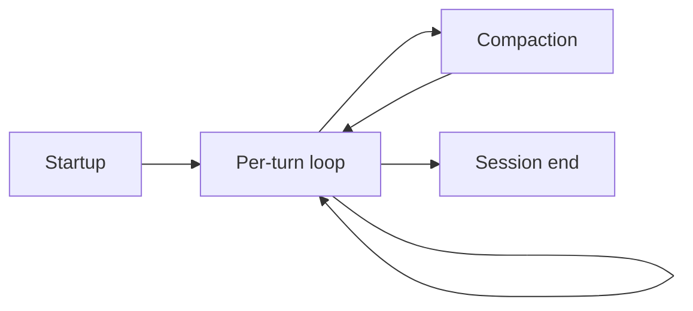

# Lifecycle

**A Claude Code session moves through an ordered set of events — startup, a repeating per-turn loop, occasional compaction, and shutdown.** This is the canonical map every foundry hook points at: a hook doc says "this fires *here*" and links back to the phase below.

> **Status:** stable

## The shape of a session

Compaction and a handful of async events (file changes, cwd changes) can fire between turns; the four phases below cover where hooks actually attach.

## Startup

- **SessionStart** — a session begins or resumes.
- **InstructionsLoaded** — a `CLAUDE.md` or rules file is loaded into context.

Neither blocks. This is where memory/context gets injected (see [meditate](../../plugins/meditate/overview)).

## The per-turn loop

Each user turn runs prompt → agentic loop → stop:

1. **UserPromptSubmit** — the prompt is submitted, before Claude sees it. *Can block* — the guard point for prompt-level policy.
2. **Agentic loop**, per tool call: **PreToolUse** (before a call — *blocks*), **PermissionRequest**, **PostToolUse** / **PostToolUseFailure** (after — *block*), **PostToolBatch** (after a parallel batch). This is where most [guard hooks](hooks/overview) live.
3. **SubagentStart / SubagentStop** — around spawned subagents.
4. **Stop** — Claude finishes responding. *Can block* — the turn-boundary hook point.

## Compaction

- **PreCompact** — before context compaction. *Can block*.
- **PostCompact** — after it completes.

The durability boundary: what survives compaction must be re-established here. See [compaction hooks](hooks/compaction-hooks).

## Session end

- **SessionEnd** — the session terminates. Cannot block; cleanup only.

## Which events can block

Blocking (can veto or modify) matters for guards: **UserPromptSubmit, PreToolUse, PostToolUse, PostToolBatch, PermissionRequest, Stop, SubagentStop, PreCompact** are the load-bearing ones. **SessionStart, PostCompact, SessionEnd** cannot block — they observe or inject, they don't veto.

## Appendix

- Full event list and semantics: [official Claude Code hooks reference](https://code.claude.com/docs/en/hooks). This page annotates the subset foundry hooks attach to; it is not an exhaustive event catalog.

## See also

- [Hooks](hooks/overview) — what we attach at each phase.
