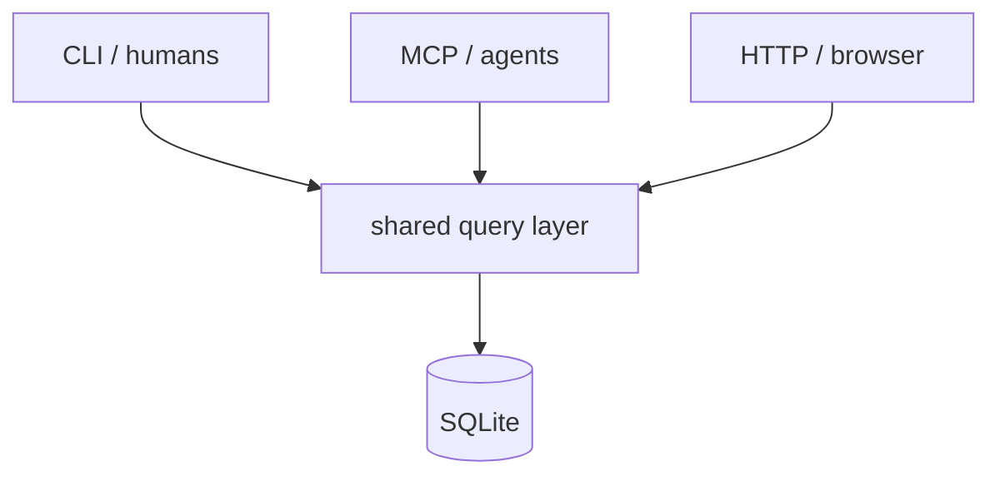

# Data Model

**The database is the spec; markdown is an export, not the working surface.** Manifold stores the goal graph in one SQLite file and inverts the usual "files + cache DB" arrangement to kill the drift question between two sources of truth.

> **Status:** stable

## DB-canonical

An earlier design stored specs as markdown files. "Markdown files + a cache DB" was rejected — two sources of truth need a sync discipline nobody wanted. So the DB *is* the spec.

| Gained | Given up (mitigated) |
|---|---|
| One source of truth, no drift question | Spec no longer lives in git as markdown — `export` produces a git-friendly tree |
| Cross-project queries are SQL, not file walks | Zero-tool readability — `dump` gives lossless NDJSON backup |
| History is structural, not "did I remember to commit" | |
| Tools build against a typed schema, not regex over frontmatter | |

## Schema shape

Stdlib only — no ORM. Roughly ten tables; `schema.sql` is canonical. Key ones:

- **`projects`** — `project_id`, `spec_config` (JSON: layer taxonomy), archive flag.
- **`nodes`** — current denormalized state: layer, title, body, `target_status`, verdict config, `rationale`, `alternatives_considered`.
- **`node_edges`** — one row per relationship (`parent` | `depends_on` | `blocks` | …). The audit-mandated choice over JSON-list-of-ID columns; recursive CTEs answer transitive queries.
- **`revisions`** — append-only, full-state snapshot per write, with `change_reason`, `actor`, `batch_id`.
- **`validations` / `verdicts`** — append-only verification runs.
- Plus `portfolio_links` and `cross_project_edges` (see [coordination.md](coordination.md)).

## Three surfaces, one query layer

**The surfaces share queries, not URLs.** Each composes `queries.py` / `writes.py` for its audience; mirroring surfaces would duplicate logic. The query layer is the contract.

## Write discipline

- **Append-only history.** Every write creates a full-state `revisions` row — time-travel is a single query, not a diff.
- **Optimistic concurrency.** Every write requires `expected_revision_id`; a mismatch returns `StaleRevision`. Load-bearing from day one even while single-process (an audit requirement), so a future Postgres backend needs no contract change.
- **Typed change reasons.** `update_node` requires an explicit `change_reason` — no silent default (see [checks.md](checks.md)).

## Pluggable verdict engine

Satisfaction is checked per node by one of four mechanisms — **not** KAOS's LTL:

| Mechanism | How |
|---|---|
| `automated_check` | shell command; exit 0 = satisfied |
| `python_assertion` | sandboxed AST walk over whitelisted helpers (no `eval`) |
| `human_signoff` | trusts the recorded status |
| `llm_judge` | shells out to an operator-configured judge command |

Results cache on a stable input hash and propagate up parents to a fixed point.

## See also

- [Foundations](foundations.md) — the graph the schema encodes.
- [Checks](checks.md) · [Trajectory](trajectory.md) · [Coordination](coordination.md)
