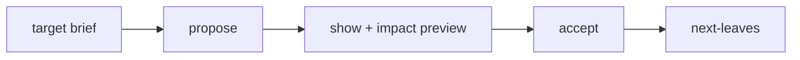

# Trajectory

**A trajectory is a reviewable proposal to evolve the spec from as-is toward a stated target — Terraform plan/apply for the goal graph.** You draft ordered changes, preview their impact, then accept; nothing mutates until you do.

> **Status:** stable

## The workflow

- **propose** drafts a trajectory of **legs** from a target brief and the current graph — no writes.
- **show** reads the trajectory and computes an **impact preview** — no writes.
- **accept** applies pending legs via the normal write APIs.

Each leg is one proposed change (`update_node`, `create_node`, or `transition_target`). `update_node` legs require `change_reason`; `transition_target` legs are checked against the state machine at propose time. Legs omit `expected_revision_id` — the engine injects the current revision at accept.

## Impact preview (plan before apply)

**`show` simulates the post-accept graph without touching it** (a rolled-back transaction). It reports what would change:

| Preview field | Meaning |
|---|---|
| `next_leaves_after` | the ready frontier post-accept |
| `next_leaves_removed` | leaves that would drop off |
| `nodes_touched` | count / list for review |
| `portfolio_delta` / `blocked_by_delta` | roll-up and cross-project changes |

Do **not** run the real `next-leaves` inside propose/show — that is execution-only, after accept.

## Trust model

**Agents may propose; only accept mutates the canonical graph.**

| Action | Mutates? |
|---|---|
| propose / `propose_trajectory` | No |
| show / `peek_trajectory` | No |
| accept / `accept_trajectory_leg` | **Yes** |

When a user states a to-be target, use a trajectory — never chain ad-hoc `update_node` calls. Always `show` before accepting a multi-leg trajectory.

**Partial-accept nuance:** the preview simulates *all* pending legs. Accept a subset and the real leaf set can differ — the preview is guaranteed to match only when every pending leg is accepted together.

## After accept

Run the real `next-leaves` to pick implementation work; optionally `spec-audit` (if legs touched rationale) and `drift-report` (if realization verdicts changed).

## See also

- [Checks](checks.md) — the queries you run around a trajectory.
- [Orchestrator boundary](orchestrator-boundary.md) — evolving spec vs dispatching work.
