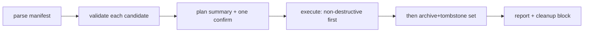

# Execution Contract

**`/meditate:apply` is a dumb executor that makes no semantic decisions — it runs a human-approved manifest against live stores under a frozen interface contract.** Smart-propose / dumb-apply / human-gate.

> **Status:** stable

## The dumb applier

The applier reads an approved manifest and executes exactly what each block says — the curator already decided; a human already gated.

- **Deletes are impossible.** `~/.claude/projects/<key>/memory/` is read-only to every shell (Bash and `!` both hit EROFS). So `drop`/`retire`/relocation **cold-archive** the memory to `~/.claude/backups/memory-archive/` (writable via the Write tool) and leave a **tombstone** with a back-pointer. Physical `rm` is handed to the user as an optional-cleanup block — never a do-or-lose step.
- **Coupled-safety ordering.** For `promote-to-rule`, the CLAUDE.md write must succeed *first*, then the source is archived+tombstoned. Generalized to **preserve-before-destroy**: archive copies of every to-be-mutated file precede any write, since no rollback exists.
- **Idempotent re-run.** Tombstones overwrite identically; a `promote` whose dest already exists reports "exists — skipped" rather than duplicating. Parse failure → abort with zero changes; per-item failure → mark failed, continue the batch, never half-apply silently.

## Execution flow

Execution runs in a safe order: non-destructive verbs first, then the archive+tombstone set, then the `promote-to-rule` CLAUDE.md edits (each followed by its source archive).

## The frozen interface contract

The contract is the **fixed boundary** between build workstreams — a shape change goes through a surfaced-issues protocol, never ad-hoc:

- **Frontmatter state vocab** (`schema_version: 2`) — `created`, `type`, `scope` (a `{depth, role}` mapping, not a fixed enum), `genericity`, `last_updated`. All required; an untagged memory is a hole in the export fence. Unknown versions are rejected.
- **Verb lexicon** — 6 disposition verbs (`promote`, `merge`, `keep`, `drop`, `promote-to-rule`, `demote-rule`) + fence/lifecycle verbs + 4 horizontal verbs (`split`, `combine`, `link`, `amend`). The shipped curator emits a codified **14-verb enum** matching the applier. Horizontal verbs are claude-store only in v1; serena candidates route to needs-human.
- **Manifest schema** — a top-level `candidates:` list; the harvester fills everything except `proposed`, the curator fills `proposed`, a human approves, the applier executes. Each candidate carries `source_path` + `content_hash` + `mtime` feeding the optimistic lock.
- **Curator agent** — a dedicated **Opus, `effort: xhigh`** agent, the **sole promoter**. Read-only (no Write/Edit/Bash); work-sessions may only *flag* candidates. It is the single chokepoint for the export-fence `genericity` call.

## See also

- [Overview](overview.md) — where apply sits in the pipeline.
- [Operation algebra](operation-algebra.md) — the verbs the applier dispatches.
- [Decisions](decisions.md) — the environment findings the contract rests on.
