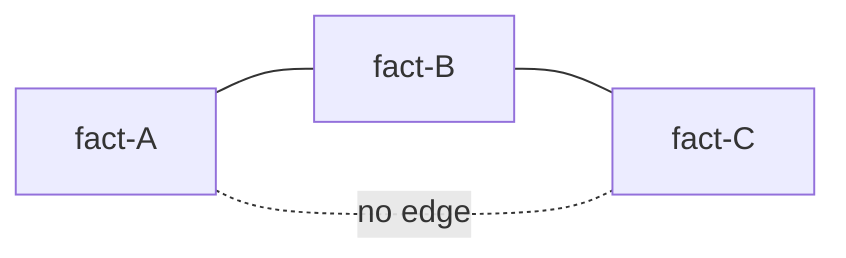

# Operation Algebra

**Meditate models curation as an algebra: atoms of meaning are conserved, and every verb is a generator that rearranges them across a grid of cells.** This is the theory behind the verb lexicon.

> **Status:** stable

## The grid

- **Cell** = `(store × scope × genericity × type)`. Every knowledge item lives in exactly one cell.
- **Atom** = an indivisible proposition — the **conserved quantity**. Operations rearrange atoms, never destroy meaning. This is *why* the system archives instead of deletes.
- **Item** = a set of atoms (one memory file or rule block); a **layer** = all items in one cell.

## Two families of generators

| Family | Generators | Moves along |
|--------|-----------|-------------|
| **Horizontal** | `split` (1→N), `combine` (N→1) | grain, *within* a cell |
| **Vertical** | `promote`/`demote` (scope), `promote-to-rule`/`demote-rule` (store), `generalize`/`specialize` (fence) | *between* cells |

`create`, `deprecate`, `retire` are the non-conservative lifecycle edges (atom birth/death). Everything else conserves atoms.

## Cohesion is a tolerance relation

**`a ~ b` = "atoms a and b belong in the same item."** It is reflexive and symmetric but **not transitive**: `A~B` and `B~C` does not imply `A~C`. Chaining similarity (single-linkage) collapses weakly-related atoms into an over-merged blob — the canonical entity-resolution failure.

Because a non-transitive relation induces a **cover, not a partition**, the "normal form" is not unique. Recovery has two parts: **extract-and-link** a bridge atom into its own `[[linked]]` item to break the chain, and treat `normalize` as a **human-ratified local fixpoint** — "normalized" means low churn, not a provable global optimum.

## The stratification law

**Normalize before promote.** A vertical step is enabled only between normalized layers; firing one may knock a layer out of normal form, which must be re-normalized (horizontal closure) before the next vertical step. The dynamics alternate: `(→H)* ; →V ; (→H)* ; →V …`.

Normalizing first makes the **unit of promotion well-defined** (you never promote half an atom or one of a duplicate pair) and destination reconciliation deterministic. This is a deliberate, conservative departure from the field's incremental auto-consolidation.

## Split, ported from database theory

`split` is **absent from every surveyed agent-memory system** (all consolidation is many→one). Meditate ports it from **3NF decomposition**:

- **Lossless-join gate** — the shared "bridge" atoms between two children must be a superkey of at least one; the union of children must entail the original. Extract-and-link satisfies this automatically.
- **Dependency-preservation** — a cohesion edge crossing the cut is reified as an explicit `[[link]]` + a one-line invariant in each child.
- **Floor** — stop when each piece is one clique (LCOM4 = 1); over-fragmentation's cost is recall-time join overhead. The split contract must *name* the severed dependency — never silently overpromise both cohesion and dependency preservation.

## See also

- [Memory model](memory-model.md) — the axes that define a cell.
- [Execution contract](execution-contract.md) — how these verbs execute safely.
