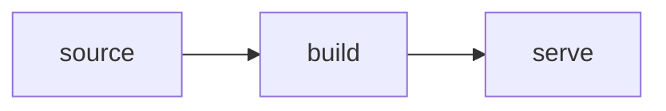

# Style

**Markdown mechanics for every page.** Content rules live in [writing.md](writing.md).

## Frontmatter

Every page opens with exactly this set:

```yaml
---
title: Page Title
status: draft        # draft | stable | shelved | parked | archived
summary: One line saying what this page is.
sources:             # in-repo paths this page consolidates (provenance)
  - path/to/source.md
updated: 2026-07-20   # YYYY-MM-DD
---
```

## Headings

- **One H1**, matching `title`.
- Then **H2/H3 only** — never deeper.

## Diagrams

- **Mermaid only** — GitHub wiki renders it natively. No images-of-diagrams.
- Use for flow, architecture, or state. **Don't diagram what a sentence covers.**
- Keep ≤ ~10 nodes. A diagram *supplements* prose, never replaces it.



## Other

- Fenced code blocks always carry a language tag.
- Links relative (`../distribution/overview.md`).
- Status callouts and notes go in blockquotes (`> **Status:** …`).
- Filenames kebab-case, placed in the subject's folder.
