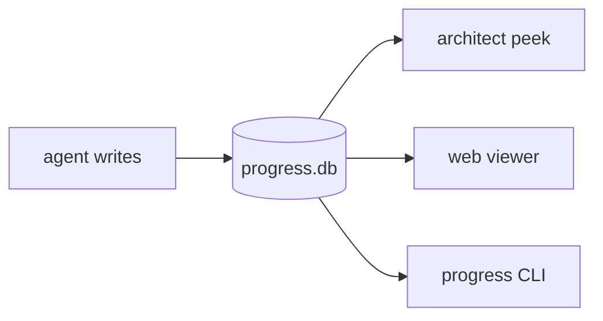

# Progress Tracker

**An MCP server that reports real-time dispatch progress so the architect can orient without re-reading thousands of tokens of plan content.** Bundled in the plan-orchestrator plugin; auto-registers via `.mcp.json`.

> **Status:** stable

## Overview

When several agents are in flight, the architect's ORIENT cycle needs **cheap status**, not full context. Dispatched agents report through small MCP writes; the architect reads compact rollups.

- **Writers** (agents): `todo_init`, `todo_start`, `todo_done`, `todo_block`, `todo_halt`, `todo_finish`, `todo_note`.
- **Readers** (architect): `peek_all`, `peek_project`, `peek_phase` are cheap rollups; `peek_dispatch` returns full item detail only when needed.

## Why DB + MCP beats per-agent files

**Per-agent `*.todo.md` files cause large per-dispatch context churn** — roughly 900 lines of redundant rewrites per dispatch — and fragment across skills. One SQLite DB plus one MCP contract serves any orchestrator without that churn.

| Per-agent `*.todo.md` | One DB + one MCP contract |
|---|---|
| ~900 lines of redundant rewrites per dispatch | small structured writes |
| fragmented across skills | one contract serves any orchestrator |
| architect re-reads full files to orient | architect peeks cheap rollups |

## Architecture

- **SQLite** at `~/.claude/progress.db` (override with `PROGRESS_TRACKER_DB`), WAL mode for concurrent agent writes + viewer reads.
- **Tables:** projects → phases → dispatches → todo_items, plus an append-only `events` table for audit history.
- **Status rolls up** from dispatches: any HALTED → HALTED, any BLOCKED → BLOCKED.
- **Web viewer** on localhost (2s poll) and a `scripts/progress` CLI read the same data.

## Deliberate limits

- Localhost-only viewer (no auth), 2s polling (no SSE yet), local DB only (no cross-machine sync).

## See also

- [Plan Orchestrator](overview.md) — the skill that drives this store.
