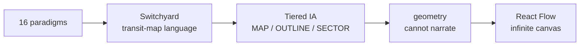

# Cartographer Overview

**Cartographer maintains a consolidated "session map" where a background reducer updates nodes in place as work is reworked, so the map reads clean top-to-bottom instead of as an append-only log.** Parked in Phase 1 — five rounds of design landed a canvas paradigm Pi likes, but the gate never closed.

> **Status:** parked — Phase 1, gate 1 open (a render the owner loves never closed it). Next step is a revive-or-archive call (tracked as issue #5).

## The idea

**Every shipped session tool is log-faithful — it renders chronology.** Cartographer is state-faithful: rework UPDATES a node (upsert), demoting correction history behind it, so the artifact always reads as "what we did and how we approached it" with provenance pointers down to transcript spans.

- **Scope** is the session, not the repo — one session may touch many repos.
- **Human-transparency tool first** — it exists so Pi can understand and steer his own sessions. Machine consumers (compaction, memory sweep) are a later bonus, never the acceptance test.
- **The renderer borrows freely; the reducer is the invention.**

## The design arc

Design-first (the manifold lesson: no implementation before visual sign-off). Iteration ran through Claude Design, then native.

- **16 paradigms** enumerated (no ranking), then narrowed with Pi visually across rounds.
- **The Switchyard** — a transit-map vocabulary (lines, stations, forks/merges) chosen from the hybrids.
- **Tiered IA** — MAP / OUTLINE / SECTOR density bands with drill-down.
- **"Geometry cannot narrate"** — the key lesson (Shahaf's Information Cartography, found independently by two agents): mechanically-derived lines render structure but not story. Fix: editorial lines + a versioned goal/intent schema (schema v2).
- **Infinite canvas** — radical pivot (2026-07-11) to a Heptabase-like React Flow canvas: draggable boxes, auto-attaching connectors, bidirectional Claude↔human sync over an owned `{nodes, edges}` JSON store with an MCP surface. **React Flow (MIT) ratified 2026-07-11.**

## Key decisions

| Decision | Ruling |
|----------|--------|
| **Vocabulary** | `cartographer` (project) · the **session map** (artifact) · **`/map`** (viewer). "Ledger" retired. |
| **Prime directive** | Design-first — no implementation until Pi's visual sign-off. |
| **Activation** | Per-session, opt-in, and REQUIRES a goal that can be decomposed into steps — the reducer gets the goal declared, not inferred. |
| **No IDs on human surfaces** | `n07`/node@version are plumbing; anchors are verbatim titles. |
| **No GitHub, ever** | Tracking lives in `MISSION.md`; foundry is local-only. |
| **Substrate** | React Flow canvas + owned JSON store + cartographer MCP server. |

## Status: parked

**Gate 1 closes only on a render Pi loves — it never did.** The canvas probe earned "much, much, much more like the way I want" but not sign-off ("still not perfect… some visibility issues"). Named kinks (real artifact links, edge anchoring, collapse/expand for loop excursions) were addressed and new scenario mocks wired, then the bundle was parked before Pi's next verdict.

- **Prototype** exists (`bundles/cartographer/prototype/`, Vite + React 18 + `@xyflow/react`).
- **Open foundational workstream:** define the taxonomy (kind vocabulary) and mereology (part-whole/nesting/collapse rules) for the session-map domain.
- **Next step is a decision, not code:** revive or archive (issue #5).

## See also

- [Roadmap](../../roadmap/overview) — the revive-or-archive decision (issue #5).
